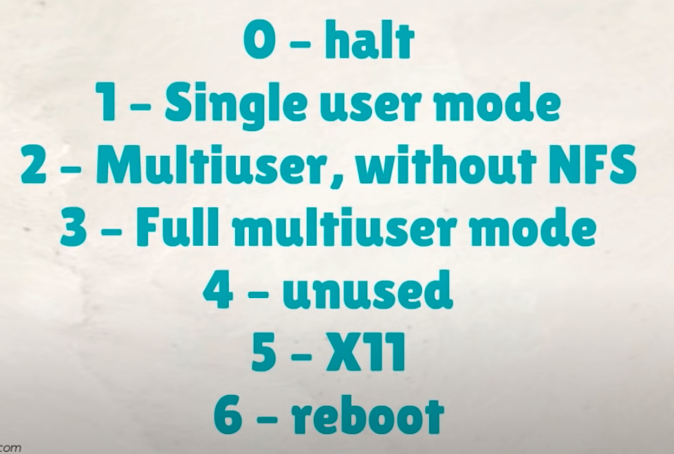
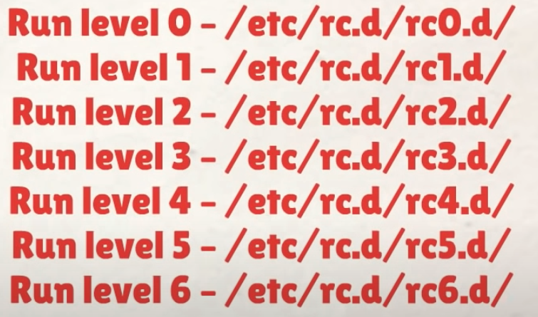
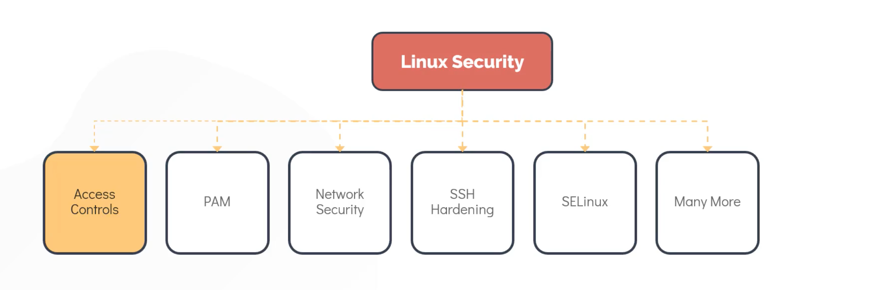
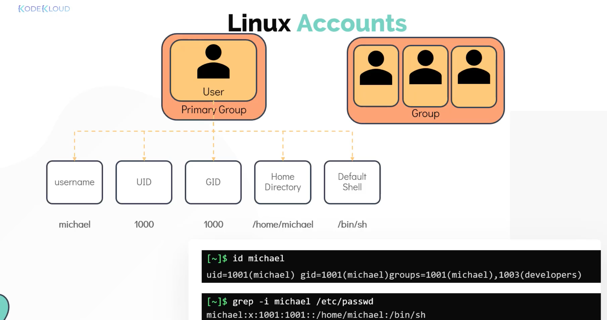
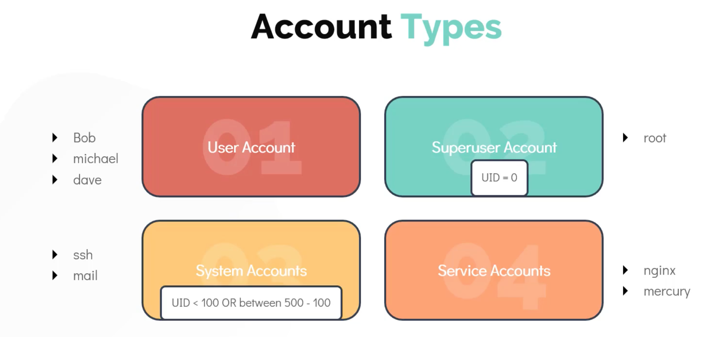
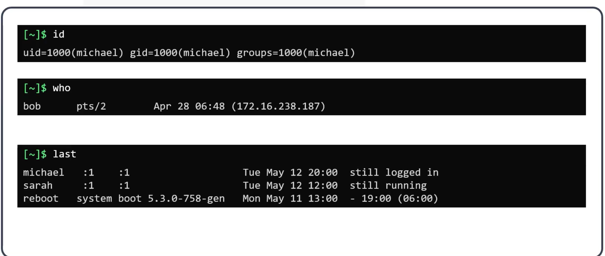
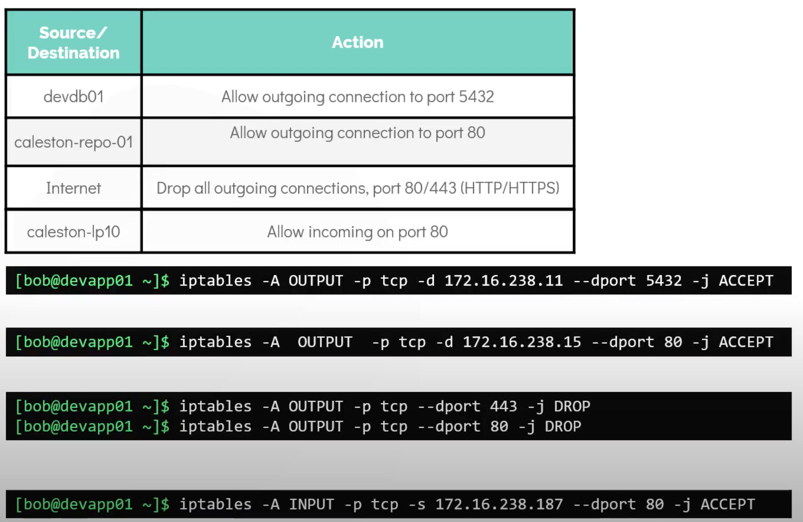
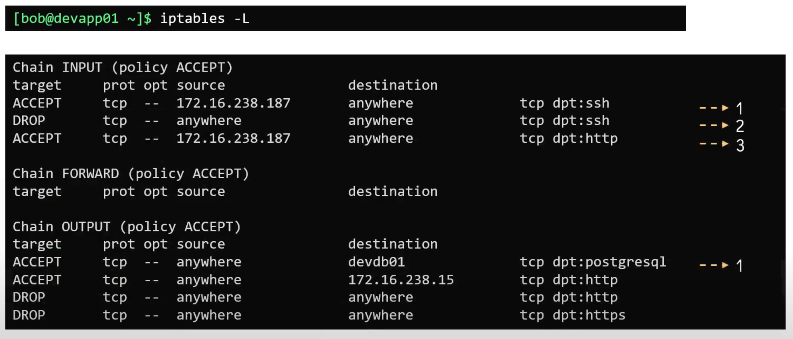
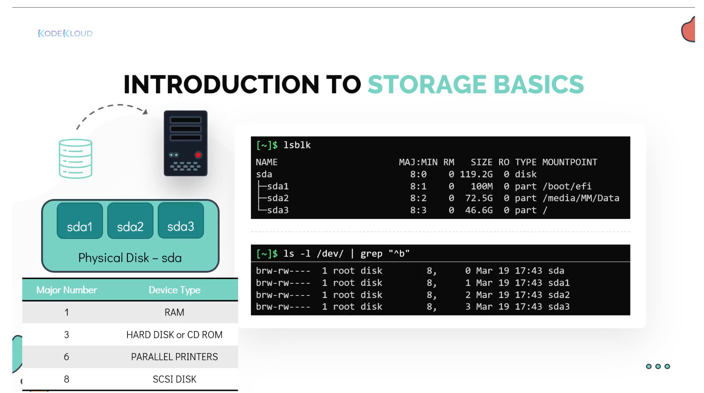

# The Linux Basics Course


* https://github.com/kodekloudhub/linux-basics-course

* Working with Shell
* Linux core concepts
* Package Management
* Shell & Bash
* Security and file permissions
* Linux Networking
* Storage in Linux
* SystemD and Services

* https://www.cs.ait.ac.th/~on/O/oreilly/unix/upt/ch08_19.htm

# Working with Shell

* https://www.vanimpe.eu/2014/01/18/different-shell-types-interactive-non-interactive-login/
* https://unix.stackexchange.com/questions/38175/difference-between-login-shell-and-non-login-shell
* https://en.wikipedia.org/wiki/Unix_shell
*

* REPL: Read-Eval-Print Loop
* Command, Argument, Options (aka. switches, flags)
* `echo Hello`, `echo -n Hello` omits the new line
* `uptime`
* Man pages: command help (manual)
* Command types:
  * Internal: Are part of the shell itself and come bundled with it
    * There are around 30 internal commands
    * `echo`, `cd`, `pwd`, `mkdir`, `set`, ...
  * External: Are binary programs or scripts that are installed in different locations on the systems
    * They usually are installed using the Linux Distribution's package manager or can be created or installed by user
  * `type <command>` tells if a command is internal or external

## Basic Linux Commands

* `pwd`: present working directory, shows the current directory where you are
* `ls`
* `mkdir`: can create multiple directories in one command
  * `mkdir <dir1> <dir2> <dir3>`
  * `mkdir -p <dir1>/<dir1>/<dir3>`: creates the dir structure including parents
* `cd`, `cd ..`
* Absolute path vs relative path
* Root directory `\`
* `pushd <dir1>`: push current directory onto the `DIRSTACK` bash variable (the directory stack of remembered directories) and then changes to `dir1`
* `dirs`: shows the contents of `DIRSTACK`, the remembered directories
* `popd`: With  no  arguments,  removes  the  top directory  from  the stack, and performs a `cd` to the new top directory.

* `mv`: move or rename
* `cp`: copy
* `rm`: remove
* to copy or remove a dir use `-r` (for recursive) switch

* `cat <file>`: print content of the file
* `cat > <file>`: shows the prompt and you can type and the press `Ctrl-D` to write the content into the file
* `touch`: create a file
* Pagers: `more`, `less`:
  * space: scroll one page
  * enter: scroll one line
  * b: to go to previous pages
  * /: to search fo a pattern
  * q: to exit
  * `more` loads entire file at once, which might not be a good option
  * `less` also allows scrolling using arrow keys

* `ls -al`: long list, and show hidden files
* `ls -lt`: list all files sorted on last modified date, use `ls -ltr` for reverse order

## Getting Help

* `whatis`: displays a one line help of what a command does
* `man`: shows man pages of a command
* `--help`, `-h`: most commands have this option to show help
* `apropos`: searches through man page names and descriptions for a given keyword, useful when you want to look up all commands that contain a specific keyword

* https://github.com/kodekloudhub/linux-basics-course


## Bash Shell

* Bourne Shell (`sh`) developed in 1970s for Unix and still in use today, C Shell (`csh` or `tcsh`), Korn Shell (`ksh`), Z Shell (`zsh`), Bourne Again Shell (`bash`)
* Different shells may have different features and facilities, but they all serve the same goal: to facilitate communication between user and the operating system
* `echo $SHELL` shows the current (default) shell being used
* Bash is one of the most popular shells, because of the features like auto-completion and brace expansion which is not available in shells like Bourne Shell
* `chsh` to change the default shell; it takes effect when you open a new terminal

### Bash shell features:
* Auto-completion
* Aliases: `alias dt=date`
* History: `history`
* Environment variables: store information about user's login session that are used by the Shell when executing commands
  * e.g. `$SHELL` or `$HOME`
  * `env` to list all the environment variables
  * `export` to set a new environment variables, e.g. `export OFFICE=munich`; This will set the variable for the current shell or any other process started by the shell
  * You can also assign a variable with `export`, like simple `OFFICE=munich`. However this will only assign the variable within the shell and the value is not carried forward to any other process
  * to make the environment variables persistent over subsequent logins or reboots add them to `~/.profile` or `~/.pam_environment` file
  * `echo $LOGNAME`
  * `echo $TERM`


* `$PATH`: paths to search for the external commands
* `which` command to check if the location of a command can be identified
* `export PATH=$PATH:/opt/obj/bin` to extend the PATH

### Customizing the Bash Prompt
* `[~]$` bash prompt can be customized to show different information, for example the logged-in user and the host name
* The bash prompt is set and controlled by a set of specific environment variables, the most common of them is `$PS1` for primary prompt
* `echo $PS1`, prints for example `[\W]$` prints `[current working directory]$`
* check the documentation for different directives you can use in `$PS1` to change the prompt:
  * `\d`: the date in Weekday Month Date format
  * `\e`: an ASCII escape character (033)
  * `\h`: the hostname HDQN
  * `\n`: new line
  * `\r`: carriage return
  * `\s`: the name of the shell
  * `\u`: username of the current user
  * `\w`: current working directory
  * `\$`: if effective UID is 0 prints a `#` otherwise a `$`


# Linux Core Concepts

## The Linux Kernel
* What is Linux Kernel and why it is important
* Kernel Space and User Space
* How Linux works with HW? How to user Kernel Modules
* Linux Boot Sequences
* Systemd Targets (Runlevels)
* Different file types and the File System hierarchy

### Kernel
* Kernel is a major component of the OS and is the interface between computer's HW and the processes running on it.


* The Kernel is responsible for four major tasks:
  * Memory Management: Keep track of how much memory is available and how much is used to store what and where
  * Process Management: Determine which processes can use the CPU when and for how long
  * Device Drivers: Acts as in intermediary or interpreter between the HW and the processes
  * System Calls and Security: Receive requests for services from the processes

* The Linux kernel is _monolithic_: This means that the kernel caries out CPU Scheduling, Memory Management, and several other operations by itself
* The kernel is also _modular_: This means it can extend its capabilities through the use of dynamically loaded kernel modules

### Linux Kernel Versions
* Ways to identify Linux kernel versions and understand the naming conventions
* Use the `uname` command to display information about the kernel
  * `uname` simply does not provide much information. It only prints `Linux` meaning the system is using a Linux Kernel
  * Use `uname -r` or `uname -a` flag to provide the print the kernel version, for example `4.15.0-72-generic`. The `4.15.0` is the kernel, major, and minor version; `72` is the patch release or patch level; `generic` is a Distro specific additional Info.
* The first Linux Kernel was developed by Linus Torvalds in 1991
* The latest release as of this recording is version `5.5.10` release on 18th March 2020
* All Linux distributions make use of any one of these kernel versions, for example Ubuntu 20.04, released in April 2020, uses the Linux kernel version 5 out of the box.
* Check out `http://kernel.org`. This is an open source project that hosts the repositories that make all versions of Linux kernel source code available to all users

### Kernel and User Space
* One of the major responsibilities of Linux Kernel is memory management
* Memory is separated into two areas: Kernel Space and User Space
  * These are synonymous to the terms Kernel Mode and User Mode
  * Kernel space is the portion of the memory in which the Kernel executes and provides its services
  * A process running in the kernel space has unrestricted access to the hardware
  * Kernel space is strictly reserved to run kernel code, kernel extensions, and most device drivers
  * All process running outside of the kernel reside on the User Space
  * User Space has restricted access to the CPU and the memory


* Most Unix like Operating Systems, including Linux, come pre-packages with all sorts of programs, such as utilities, programming languages, graphical applications, etc. These are called User Space Applications. This is also often referred to "The User Land"
* Programs in the User Spaces make _system calls_ to the kernel to access hardware, such as memory and the disk. Examples of the system calls are memory allocation or opening a file


* Examples of some common system calls to access file system are `open()`, `close()`, `readdir()`, `strlen()`, `closedir()`


## Working with Hardware

* How Linux identifies and manages the HW while it is attached to the system
* List and get detailed information about the devices attached to the system from the command line
* Let's take the example of USB disk attached to the computer
  * As soon as the disk is attached to the system, a corresponding device driver, which is part of the kernel space, detects the state change and generates an event
  * This event, which is called a _uevent_ is then sent to the user space device manager called _udev_
  * The _udev_ service is then responsible for dynamically create a _device node_ associated with the newly attached drive in the `/dev/....` file system
  * When this process is complete, the newly attached disk must be visible under `/dev/...` file system


* Some ways to list and get detailed information about the HW attached to a Linux system:

* `dmesg` is a tool used to display messages from an area of the kernel called _ring buffer_
  * When a Linux OS boots up, there are numerous messages generated by the kernel
  * These messages also contain logs from the HW devices that the kernel detects and provide good indication whether it can configure them
  * You can redirect the output of `dmesg` using `less`, or search for specific keywords using `grep`
  * `dmesg | grep -i usb`

* `udevadm` is the management tool for udevs
  * `udevadm info` command queries the udev database for information about devices.
  * For example `udevadm info --query=pat --name=/dev/sda5` queries a hard disk attached to the system
  * `udevadm monitor` listens to the kernel uevents
  * Upon detecting and event, it prints the details such as the _device pat_ and _device name_ on the screen
  * This command is quite handy to determine the details of a newly attached or removed device
  * Example below shows when a USB mouse is removed from the system


* `lspci` lists and displays information about all the PCI devices connected and configured in the system
  * examples of PCI devices are ethernet cards, video cards, RAID controllers, wireless adapters

* `lsblk` lists information about _block devices_
  * For example below the `sda` is the physical disk; `sda1` to `sda5` are partitions created on this disk
  * In the output of `lsblk`, the TYPE `disk` is the physical disk and the type `part` is a partition
  * Also the `MAJ:MIN` are the major and minor numbers associated with each device. The major number identifies the type of device driver associated with the device. For example number `8` refers to a _block s disk_ device. The minor is used to differentiate between devices that are similar and have the same major number.
  * The table shows some of the commonly used devices along with their major numbers


* `lscpu` displays information about the CPU, such as architecture, socket number, number of cores, threads per core, vendor id, and model name
  * CPU(s) = sockets x cores per socket x threads per core

* `lsmem` list the available memory on the system
  * `lsmem --summary`
* `free -m`  shows the total available vs used memory on the system. `-m` shows the result in MB, `-k` in kB, `-g` in GB

* `lshw` gives detailed information about entire HW configuration on a machine
  * exact memory configuration
  * Firmware version
  * Mainboard configuration
  * CPU version and speed
  * Cache configuration
  * Bus speed
  * and much more
  * `lshw` requires `sudo` to show all information

* with `sudo` you can control which user can run commands as super user; you can also define which commands they can run, and even replay back commands they have run with root privileges.


## Linux Boot Sequence

* Boot processes can be simplified divided into 4 major steps:
  1. BIOS POST
  2. Boot Loader (GRUB 2)
  3. Kernel Initialization
  4. INIT Process, service initialization using _systemd_

* The Linux boot process can be initiated by
  * starting a Linux device that is in _halted_ or stopped state
  * or, by rebooting (aka resetting) the system

* BIOS POST: Is the Power-on Self Test run by BIOS to ensure that device hardware are running correctly. If POST fails the computer may not be operable and the system will proceed to the next step after POST

* After a successful POST, the BIOS loads and executes the boot code from a boot device, which is located at the first sector of the hard disk
  * In Linux, this is located at the `/boot/` file system
  * The boot loader provides the user with the boot screen, often with multiple options to boot into, such as MS Windows or Ubuntu 18.04...
  * Once the user selects an option in the boot screen, the boot loader loads the kernel into the memory, supplies it with some parameters, and hands over the control to the kernel
  * A popular example of a boot loader is GRUB 2, which stands for Grand Unified Bootloader version 2
  * GRUB 2 is the primary boot loader for most current linux distros

* After the selected kernel is loaded into the memory, it is usually decompressed. This is done, as the kernels are usually in a compressed state to save space.
  * The kernel is then loaded into the memory and starts executing
  * During this phase the kernel carries out a series of tasks, such as initializing HW and memory management tasks, ...

* Once the kernel is completely operational
  * it looks for an `init` process to run, which sets up the user space and the processes needed for the user's environment
  * in most of the current day Linux distros, the `init` function then calls the `systemd` daemon
  * the `systemd` is then responsible for bringing the Linux host to a usable state

* `systemd` is responsible for
  * mounting file system
  * starting and managing services
  * it is the universal standard these days
  * but not too long ago, another initialization process called `SystemV` (read System Five, or Sys Five) init was used
  * SystemV was for example used in RHEL 6 or CentOS 6 distros
  * One of the key advantages of using systemd over SystemV is that it reduced system startup time by parallelizing startup of services

* To check which init system is used run
  * `ls -l /sbin/init`
  * it output something like `lrwxrwxrwx   /sbin/init   ->    /lib/systemd/systemd` for systemd
  * basically the `/sbin/init` is a link to the actual init process


## Runlevels

* Linux can run in different modes, such as graphical mode
* You can configure your system to boot into a specific mode
* Modes are set by _Runlevels_

* `runlevel` command shows the current operation mode of the system, for example `3` or `5`
  * Runlevel 5 is the operation mode that provides graphical user interface, runlevel 3 implies a non-graphical mode
  * During boot the init process checks the runlevel and makes sure all the programs that are needed to make the system operational in that mode are started
  * For example the graphical user mode requires a display manager service to run, so that the GUI can work.

* So a runlevel is basically a name for grouping of the programs that are needed to run for a specific operation mode of the system
* Runlevel were used in SystemV and are not obsolete with systemd.
* SYSTEMD uses systemd targets instead
* for example the runlevel 3 is called the `multiuser.target` and runlevel 5 is called `graphical.target`
* Look at `man runlevel` for mapping between runlevels and systemd targets

* `systemctl get-default` to get the default systemd target
  * it looks up the file at `/lib/systemd/system/default.target` or `/etc/systemd/system/default.target`
  * which is a link to the default target file, for example `/lib/systemd/system/graphical.target`

* `systemctl set-default multi-user.target` changes the default target
  * output: `Created symlink /lib/systemd/system/default.target  -> /lib/systemd/system/multi-user.target`


* https://askubuntu.com/questions/34308/where-is-the-inittab-file
* 
* 
* In the runlevel dirs above, programs whose name starts with `S` are run during startup, and programs whose name starts with `K` are run during shutdown (kill); The sequence numbers define the order of running the programs, `S12`, `S50`, `S80`

* The term runlevels is used in the sysV init systems. These have been replaced by systemd targets in systemd based systems. The complete list of runlevels and the corresponding systemd targets can be seen below:
  * runlevel 0 -> poweroff.target
  * runlevel 1 -> rescue.target
  * runlevel 2 -> multi-user.target
  * runlevel 3 -> multi-user.target
  * runlevel 4 -> multi-user.target
  * runlevel 5 -> graphical.target
  * runlevel 6 -> reboot.target
  * https://askubuntu.com/questions/34308/where-is-the-inittab-file
  * From `man inittab`: The  `/etc/inittab`  file was the configuration file used by the original System V init(8) daemon. The Upstart init(8) daemon does not use this file,  and  instead  reads its  configuration  from  files  in  /etc/init.   See  init(5) for more details.
  * Back in the days the "System-V" init service was used in Ubuntu, and it used the /etc/inittab file. Some time ago (around 2006) the "Upstart" init service replaced SysV. During these days you could follow the top answer and use man inittab to get info on this change. At the time of writing (e.g. for Ubuntu 16.04) the "systemd" boot process is in use and there is no reference left to "inittab" (e.g. if you do apropos inittab you'll probably not find anything). Instead you could do man runlevel to get similar information. Bottom line: the /etc/inittab file is nowhere, likely because you use a newer version for Ubuntu that has a different init service, e.g. systemd.

## File Types
* Everything is a file in Linux
  * i.e. Every object in Linux can be considered to a be a type of file. Even a directory is a special type of file.

* There are three file types in Linux
  * Regular: normal files, like text, shell scripts, images, etc.
  * Directory: a type of files that contains other files
  * Special files:
    * Character files: represent the devices under `/dev/` file system. These allow the OS to communicate with IO devices *serially*. Examples include devices such as mouse and keyboard.
    * Block files: these are files representing *block devices*, also located under `/dev/`. Block devices write and read data from device in blocks (chunks of data), for example hard disk and RAM. `lsblk` lists block devices.
    * Links: links are a way to associate two of more file names to the same file containing data. There are two kinds of links:
      * Hard links: associates two are more file names with the same block of data on the physical disk. Although they behave as independent files, *deleting one link with delete the data*
      * Symbolic links: or symlinks are like pointers to the data in a file. They can be loosely compared to shortcuts in Windows. Deleting a symlink does not delete the data.
    * Sockets: sockets enable communication between two process
    * Named Pipes: allow connecting one process as an input to another. The dataflow in a pipe is *unidirectional* from the first process to the second.

* `file` command displays the file type
* `ls -l` also shows the file type as the first letter before permissions: `d`: directory; `-` regular file; `c` character file; `l` link; `s`: socket; `p`: pipe; `b`: block device;


## File System Hierarchy

* `/home`: home dir for all users except the root
* `/root`: home for root
* `/opt`: put any third-party programs here, for example install a web app there
* `/mnt`: mounted file systems using `mount` command
* `/tmp`: temp
* `/media`: all external media (USB disk, external hard disk, etc) are mounted here
  * `df -hP`: disk free, `-h` human readable, `-P` portability POSIX output format; lists information about all mounted file systems
* `/dev`: contains character and block file devices
* `/bin`: contains the basic programs in binary, e.g. `cp`, `mv`, `mkdir`, `date`, ...
* `/etc`: stores most of the configurations
* `/lib` and `/lib64`: shared libraries used by different programs are stored here
* `/usr`: was used for user home directories, but in modern Linux it is the location where all the *user land* applications, libraries, and their data resign. For example, Thunderbird, FireFox, vi, ...
* `/var`: is where the systems writes data of the running systems, such as logs and cached data


# Package Management

## Package Management Introduction

* There are 100s of Linux distros in use today. One of the ways to categorize distros is based on the package manager they use.
  * For example, distros such as RHEL, CentOS, Fedora are based on RPM package manager. They are known as RPM-based distros. RPM packages have the extension `.rpm`
  * Debian, Ubuntu, Arch Linux, Linux Mint, ... use the Debian Package Managers, such as DPKG. Debian packages have the extension `.deb`

* A package is a compressed archive that contains all the files that are required for a software to run
* For example, to instal GIMP (GNU Image Manipulator) on Ubuntu we use the package `gimp.deb`. It contains all the files needed for GIMP to run, such as Application Binaries, Metadata, Configuration files, ...
* You can basically download a package and install it on the Linus using the `.deb` or `.rpm` package file. So why do we need a package manager?
* A packages manager takes care of all the dependencies of a package and their transitive dependencies and makes sure all the software and dependencies are compatible with the installed Linux distro and version.
* `dpkg -i gimp.deb` installs GIMP. But it fails if GIMP's dependencies are not installed on the system.
* A package manager provides a consistent process of installing, configuring, upgrading, and removing packages on a Linux system
* Some of the essential functions of a Package Manager are:
  * Ensuring the integrity and authenticity of packages, by verifying their digital certificates (digitally signed code) and their checksums. This is to ensure that the package is downloaded from a trusted source and is safe to install
  * Simplified Package Management process: Most Package Mangers provide powerful tools for querying packages in a package repository, downloading, installing, or updating existing software
  * Grouping packages by their function
  * Managing dependencies and avoiding dependency hell

* Different packages managers, depending on distro:
  * DPKG: (Debian Package) base package manager of Debian-based distros
  * APT: (Advanced Package Tool) a newer frontend for DPKG found in newer distros such as Ubuntu, Linux Mint, Elementary OS, ...
  * APT-GET: traditional frontend for the DPKG in Debian-based distros
  * RPM: (RPM Package Manager, or Red Hat Package Manager) base package manager found in Red Hat-based distributions, such as RHEL, CentOS, Fedora
  * YUM: a frontend for the RPM found in RedHad-based distros
  * DNF: a more feature-rich frontend for the RPM.


## RPM and YUM

* RPM is used in Red Had-based distros, such as RHEL, CentOS, fedora, ...
* RPM packages have extension `.rpm`
* RPM has five base modes of operations:
  * Install: `rpm -ivh telnet.rpm`: install a package, `-i` install, `-v` verbose
  * Uninstall: `rpm -e telnet.rpm`
  * Upgrade: `rpm -Uvh telnet.rpm`
  * Query: The RPM database at `/var/lib/rpm` store information about all the packages installed on the system, such as which packages are installed, which version each package is, and any changes to any files after installation. `rpm -q telnet.rpm` queries this database and gives information about a packages
  * Verify: `rpm -Vf <path to file>` verifies a package to make sure it is installed from a trusted and secured source. It compares information about the files installed from package, with the same information from the package metadata
* RPM *does not resolve package dependencies on its own*. That's why we use a higher-level package manager called YUM

* YUM (Yellow Dog Updater Modifier) works on RPM-based distros. Talks to RPM software repositories.
* Repository info is stored at `/etc/yum.repos.d`. Repository files have a `.repo` extension.
* YUM is a high-level package manager that relies on RPM to mange packages
* YUM handles package dependencies unlike RPM
* Software repositories can be local or on the network. Usually the distro comes bundled with its own software repositories, e.g. `/etc/yum.repos.d/redhat.repo`. You can add new repos in `/etc/yum.repos.d` if the software is not found in the official repo, not the lates version, for example `/etc/yum.repos.d/nginx.repo`
* How YUM works: `yum instal httpd`
  * YUM first checks if the package is installed on the system
  * If not, it checks all the configured repos for the availability of package
  * It checks if any dependencies of the software is installed or needs to be upgraded.
  * A *transaction* report is shown to the user to confirm
  * Download and install the necessary `.rpm` packages

* `yum repolist`: show all the repos added to the system
* `yum provides scp`: to check which package to be installed for `scp` command to work
* `yum remove httpd`: remove a package
* `yum update telnet`: update a package
* `yum update`: update all the packages and their dependencies on the system


## DPKG and APT

* DPKG is the base package manager on Debian-based distros (similar to RPM in Red Hat-based distros)
* It can be used to
  * Install/Upgrade
  * Uninstall
  * List
  * Status
  * Verify
* Debian packages have `.deb` extension
* `dpkg -i telnet.deb` install a package
* `dpkg -r telnet.deb` remove a package
* `dpkg -l telnet` list packages with their version number and short description
* `dpkg -s telnet` to see the status of a package and if it is installed on the system
* `dpkg -p <path to file>` to display information about the package, such as version number, maintainer, ...

* DPKG does not resolve dependencies (similar to RPM). We have to rely on higher-level package managers such as APT or APT-GET
* APT and APT-GET are higher level package managers on Debian-based systems
  * APT (Advanced Package Tool) is more user-friendly and newer that APT-GET
* APT (similar to YUM) relies on software repos for downloading software. Software repos for APT are in `/etc/apt/sources.list`. The repo can be a local one on local file system or on a CD, or it can be remote, accessed over FTP, HTTP, HTTPS


* `apt update`: refresh the repos by downloading all package information from all the sources; run it after adding a new repo, or before installing any new package
* `apt upgrade`: upgrade all packages
* `apt edit-sources`: opens up the `/etc/apt/sources.list` in a text editor
* `apt install telnet`: install
* `apt remove telnet`: remove
* `apt search telnet`: look up for a package in the repos
* `apt list | grep telnet`: list all the packages (installed and not installed)

* Difference APT and APT-GET:
  * more user friendly
  * progress bar
  * `apt search search` vs. `apt-cache search telnet`


# Working with Shell II
* Linux is very user friendly; it is just very selective who it is friends with :D

## File Compression and Archival
* `du`: Disk Usage shows size of files and directories
* `du -sk`: shows size of file or dir in Kilo Bytes
* `du -sh`: shows the size in human readable format
* `ls -lh`: also shows the human readable size of the file in the listing


* tar (tape archive) creates a single archive of multiple files. Archive files created with TAR are sometimes called tarballs
* `tar -cf test.tar file1 file2 file3` creates an archive of the files. `-c` for create, `-f` for the filename of the archive
* `tar -tf test.tar` list the content of the file. `-t` or `--list`
* `tar -xf test.tar` extracts the archive
* `tar -zcf test.tar file1 file2 file3` creates a compressed (zipped `-z`) archive

* There are different programs for compressing files on the Linux:
  * `bzip2`
  * `gzip`
  * `xz`
* For decompressing:
  * `bunzip2`
  * `gunzip`
  * `unxz`
* For listing the content of the zipped file without decompressing it:
  * `bzcat`
  * `zcat`
  * `xzcat`
* The size of compressed file depends on the type of the data and the compression algorithm


## Searching for files and patterns
* `locate City.txt`  searches for a keyword and returns all paths in the file system with the keyword
  * The downside of `locate` is that it it depends on a database at `/var/lib/mlocate/mlocate.db`
  * the `mlocate.db` is updated once a day by a `cron` job
  * `sudo updatedb` updates the locate database

* `find /home/michael -name City.txt` searches for a file called `City.txt` under the directory `/home/michael`
  * `find` is a very powerful command with many options

* `grep <pattern> <filename>` searches within files for a given pattern
* `grep -i` search case-insensitive
* `grep -r` search recursively within all files in a directory and its subdirectories
* `grep -v` list the opposite. It prints all lines that does not contain the pattern
* `grep -w` search for whole word
* `grep -A<X>` and `grep -B<X>` print X number of lines after or before the line matching the pattern
  * similar to `-context <X>`


## IO Redirection
* In Bash and other Linux shells, when a program is executed, it uses three standard I/O streams. Each stream is represented by a numeric file descriptor:
  * 0 - stdin, the standard input stream.
  * 1 - stdout, the standard output stream.
  * 2 - stderr, the standard error stream.
  * A file descriptor is just a number representing an open file.
* `echo $?` prints the exit code of the program

* With IO Redirection, the standard input, output, and error can be redirected to text files
* `echo $SHELL > shell.txt`. The `>` OVERWRITES the content of the file with the output of the STDOUT of the command
* `echo "hello" >> shell.txt`. The `>>` appends the stdout to the end of file

* To redirect the error messages (stderr) use `2>`
* To suppress the error messages from being displayed on the screen, redirect stderr to /dev/null: `command 2> /dev/null`
* `/dev/null` is Null Device, also called Bitbucket. Everything written to it will be discarded.
* To redirect stderr to stdout and have error messages sent to the same file as standard output, use the following:
  * `command > file 2>&1`
  * `> file` redirect the stdout to `file`, and `2>&1` redirect the stderr to the current location of stdout.
  * The order of redirection is important. For example, `command 2>&1 > file` redirects only stdout to file. This happens because the stderr is redirected to stdout before the stdout was redirected to file.
  * Another way to redirect stderr to stdout is to use the `&>` construct. In Bash `&>` has the same meaning as `2>&1`:
  * `command &> file` is the same as `command > file 2>&1`

* `grep -r hello /sys/ > /dev/null 2>&1` nothing is printed. stdout is redirected to `/dev/null` and stderr is redirected to stdout. So, everything (stdout, stderr) is sent to `/dev/null`
* `grep -r hello /sys/ &> /dev/null` does the same
* to see the exit code of the program use `echo $?`

* A Pipe `command1 | command2` makes the stdout of the `command1` to be the stdin of `command2`
* `tee` The tee command reads from the standard input and writes to both standard output and one or more files at the same time. tee is mostly used in combination with other commands through piping.
* `command | tee file1.out file2.out file3.out` write the output of the command to stdout and also the the files
* `tee -a` appends the file instead of overwriting
* `tee` is handy in combination with `sudo`
  * `sudo echo "newline" > /etc/file.conf` does not work, because the redirection is not run by `sudo` but with the unprivileged user. It will result in `bash: /etc/file.conf: Permission denied`
  * `echo "newline" | sudo tee -a /etc/file.conf` will do the work

* https://www.cs.ait.ac.th/~on/O/oreilly/unix/upt/ch08_19.htm
* https://unix.stackexchange.com/questions/159513/what-are-the-shells-control-and-redirection-operators

* https://www.cs.ait.ac.th/~on/O/oreilly/unix/upt/ch08_19.htm


## VI Editor
* Using `cat > blah.txt` we can start typing and into file `blah.txt`. Pressing `CTRL-D` (EOT, End-of-Transmission) writes the typed text into file.

* `vi <filename>`
* vi Operation Modes:
  * Command mode: give commands to the editor, such as copy, paste, delete, navigate between lines, ... Press `Esc` to go to command mode from other modes
  * Insert mode: lets you enter text. Press `i`, `a`, `o`, `I`, `A`, `O` (each doing a different thing)  to go insert mode.
  * Last line mode: commands to save changes, discard changes, exit, ... Press `:` to go to Las line mode
  * default mode is command mode

* Command mode:
  * `k j l h` to move the cursor
  * `v` for highlighting in visual mode
  * `yy` copy (yank) line
  * `p` paste
  * `ZZ` save the file
  * `x` delete the letter at cursor
  * `dd` delete line
  * `dNd` delete N lines from current line
  * `u` undo
  * `r` redo
  * `/` find text downward, press `n` next down, `N` next up, `?` search upward (revers)

* Insert mode:
  * `i`, `a` insert text before, after cursor
  * `I`, `A` insert in the line before, after cursor
  * `o`, `O` insert new line before, after cursor

* Last line (commend line) mode:
  * `:` activate command line mode
  * `:w` save teh file
  * `:q` exit
  * `:wq` write and quit
  * `:q!` quit without saving

* VIM: Vi Improved is a newer more feature rich version of vi
  * in most distros the command `vi` is a symlink to `vim`


# Security and File Permissions

* Basic security and identifying file types
* Creating users and groups
* Managing file permissions and ownerships
* Special directories and files



* Security in Linux includes many aspects, amongst others:
  * Access Control
  * PAM: Pluggable Authentication ModulesLinux Pluggable Authentication Modules (PAM) is a suite of libraries that allows a Linux system administrator to configure methods to authenticate users. It provides a flexible and centralized way to switch authentication methods for secured applications by using configuration files instead of changing application code.[1] There are Linux PAM libraries allowing authentication using methods such as local passwords, LDAP, or fingerprint readers.[2] Linux PAM is evolved from the Unix Pluggable Authentication Modules architecture. Linux-PAM separates the tasks of authentication into four independent management groups:
    * account modules check that the specified account is a valid authentication target under current conditions. This may include conditions like account expiration, time of day, and that the user has access to the requested service.
    * authentication modules verify the user's identity, for example by requesting and checking a password or other secret. They may also pass authentication information on to other systems like a keyring.
    * password modules are responsible for updating passwords, and are generally coupled to modules employed in the authentication step. They may also be used to enforce strong passwords.
    * session modules define actions that are performed at the beginning and end of sessions. A session starts after the user has successfully authenticated.
    * https://en.wikipedia.org/wiki/Linux_PAM
  * Network Security: Mostly using Firewall rules, IP Tables, ...
  * SSH Hardening: Make sure only authorized users have remote access to a Linux system
  * SELinux: Security-Enhanced Linux (SELinux) is a Linux kernel security module that provides a mechanism for supporting access control security policies, including mandatory access controls (MAC). SELinux is a set of kernel modifications and user-space tools that have been added to various Linux distributions. Its architecture strives to separate enforcement of security decisions from the security policy, and streamlines the amount of software involved with security policy enforcement. The key concepts underlying SELinux can be traced to several earlier projects by the United States National Security Agency (NSA).

## Linux Accounts
* Every user has an account in Linux:
  * User account maintains the information such as username and password used to login to the system
  * A user account contains an identifier called **UID**, which is unique for each user
  * Information about user accounts is stored in `/etc/passwd` file

* A group is a collection of users; it is used to organize users based on common attributes such as role or function
  * Information about groups is stored in `/etc/group` file
  * Each group has a unique identifier called **GID**
  * Groups can be used to grant access to files and directories to a group of users

* A user account contains:
  * username
  * UID, user ID
  * GID, the ID of the group the user is part of. Each user is member of a default group with the same ID as the UID (a group with the same name as username). It is assigned if no group is defined for the user when it is created. This is the primary GID of the user. A user can be member of multiple groups.
  * information about user's home dir e.g. `/home/<username>`
  * default shell for the user, e.g. `/bin/sh`

* `id` command prints information about the user: uid, gid, groups
* `grep -i <username> /etc/passwd` prints the entry of the user in the `/etc/passwd` file, showing username, uid, gid, home dir, default shell, ...



* There are other types of accounts apart from normal users:
  * super user account: root, uid=0; Root has unrestricted access to everything on the system
  * system accounts: created when the OS is installed, and are used by the programs and software that is not supposed to run as root. Examples are ssh, mail,... These accounts have uid below 100 or between 500 to 1000; They normally don't have a home directory, of if they have, it is not under `/home`
  * service accounts: are similar to system accounts and are created when services are installed, such as nginx, mercury, ...



* Commands to see information about users:
  * `id`: shows information about a user
  * `who`: shows a list of users currently logged in to the system
  * `last`: shows a record of all logged in users, and date and time the system was last rebooted



* Switching user:
  * `sudo`: run programs with the security privileges of another user, by default the superuser.
  * `su`: switch to any other user, e.g `su jane` and enter jane's password. When used with a hyphen e.g. (`su - jane`) it can be used to start a login shell. In this mode users can assume the user environment of the target user. `su -` login as root
  * `su -c <username>` The meaning of “command” is slightly different: for `su -c`, it's a string that's executed by the target user's shell, whereas for `sudo` with no options, it's a program to run with arguments. But for common usage, they're the same.
  * https://askubuntu.com/questions/620936/difference-between-su-and-sudo-su
  * https://askubuntu.com/questions/70534/what-are-the-differences-between-su-sudo-s-sudo-i-sudo-su
  * https://askubuntu.com/questions/331062/what-is-the-functional-difference-between-sudo-su-and-sudo-i
  * https://unix.stackexchange.com/questions/16334/what-is-the-difference-between-sudo-and-su-c

* `shopt`: This builtin allows you to change additional shell optional behavior.

* sudo:
  * `/etc/sudoers`: defines the policy used by the `sudo` command
  * `visudo` update the `/etc/sudoers` command
  * only users listed in the `/etc/sudoers` can use `sudo` for privilege escalation
  * using `/etc/sudoers` users can be granular privileges to use `sudo`, for example which command can a user run using sudo
  * the syntax of the `/etc/sudoers` file: user or group, e.g. root, or %admin; hosts; as-user:as-group; command. In all cases ALL means no restriction

* Using `sudo` we can eliminate the need to ever login as root
  * by setting `/usr/sbin/nologin` as the default shell for the root user


## User Management
* `useradd bob`
  * creates a user with name `bob` using system generated GID and UID
  * creates the home folder for the users under `/home/bob`
  * sets the default shell to `/bin/sh`
* `grep -i bob /etc/passwd`
* `passwd bob`: set the password for user bob
* `grep -i bob /etc/shadow`
  * `/etc/shadow` file contains hashed passwords of the users
* `whoami` prints the user name of the current user
* `passwd` change password
* Common options for `useradd`
  * `-c` add a custom command
  * `-d` custom home directory
  * `-e` account expiration date
  * `-g`, `-u` custom GID and UID
  * `-s` specify the shell
  * `-G` add user to multiple secondary groups

* `useradd -u 1009 -g 1009 -d /home/robert -s /bin/bash -c "Mercury project member" -G docker mercury bob`
* `id bob`

* `userdel bob`: delete user bob
* `groupadd developer`: add a group with name developer
* `groupadd -g 1011 developer` add a group with name developer and custom GID 1011
* `groupdel developer` delete the developer group


## Access Control Files
* Access control files are stored under `/etc/` directory, which is by default readable by everyone and writeable by root
  * `/etc/passwd`: the password file, contains information about users, like username, UID, GID, optional information, home dir, default shell
  * `/etc/shadow`: contains hash of user passwords and information about its duration and expiration date
  * `/etc/group`: information about groups
  * The access control files are not plain text editable and are supposed to be changed only through built-in commands such `passwd` or `useradd` to change them
  * The fields in access control files are separated using a colon `:`

* `/etc/passwd`
  * Fields are `USERNAME:PASSWORD:UID:GID:GECOS:HOMEDIR:SHELL`
  * Password is not saved here. It is located in `/etc/shadow`
  * `GECOS` is csv user information such as full name, location, phone number, etc.

* `/etc/shadow`
  * Fields are: `USERNAME:PASSWORD:LASTCHANGE:MINAGE:MAXAGE:WARN:INACTIVE:EXPDATE`
  * `PASSWORD` is the hash of user's password. An empty or `*` means no password is set
  * `LASTCHANGE`: last time password was changed as epoch timestamp
  * `MINAGE` and `MAXAGE`: min days before password can be changed; max days after which the password must be changed
  * `WARN`: number of days to warn user for changing the password
  * `INACTIVE`: number of days after password has expired, that the password is still active and can be used. Empty means not set.
  * `EXPDATE`: epoch timestamp when the password will expire. Empty means not set

* `/etc/group`:
  * Fields: `NAME:PASSWORD:GID:MEMBERS`
  * `MEMBERS` is the comma separated list of usernames that are members of this group


## File Permissions and Ownership

* `ls -l` command list the files with their type and permissions
  * `-rwxrwxr-x`
  * The firs column determines the type of file: `-` normal file; `d` directory; `l` link; `c` character device file; `b` block device file; `s` socket file (or sticky bit); `p` name pipe

* Permissions are Read (`r`, octal 4), Write (`w`, octal 2), Execute (`x` octal 1), or no permission (`-` octal 0)
  * Each file or directory has a user owner and a group owner
  * Permissions are in sequence for User owner, for Group owner, and for Others
  * Execute (`x`) for directory means user can `cd` into directory
  * If the current user is the user owner, then permissions for user owner are considered, and the rest (permissions for group and others) are not considered.

* `chmod <permissions> <file>` sets the permissions
  * permissions can be set using symbolic notation or octal notation
  * `chmod +rwx myfile` sets all permissions for user, group, and others
  * `chmod u+rwx myfile` sets read, write, execute for user
  * `chmod ugo+r-x myfile`
  * `chmod o-rwx myfile` remove rwx from others
  * `chmod u+rwx,g+r-x,o-rwx myfile`
  * `chmod 775 myfile` sets rwx for user and group and r-x for others

* `chown owner:group file` changes the user owner and group owner of the file
  * if no group is provided, only the user owner is changed

* `chgrp` changes the group owner of a file
  * `chgrp developers myfile`


## SSH and SCP

* SSH: used to login into remote systems
  * `ssh <hostname OR IP address>` of the remote machine; no user name is specified, it tries to login as the current user
  * `ssh <username>@<hostname OR IP address>`
  * `ssh -l <user> <hostname OR IP address>`
  * For SSH the remote host must have an SSH server process running and port 22 on remote host must be accessible by the client
  * Your computer is SSH client and remote host is SSH server
  * Instead of password, SSH keys can also be used for authentication

* Using SSH keys you can authenticate without password
  * Key pair: public key and private key
  * `ssh-keygen -t rsa` generates the key pair
    * Key pair is stored in `~/.ssh/` public key `id_ras.pub` and private key `id_rsa`
  * The public key must be copied to the remote host
  * `ssh-copy-id <user>@<remote_host>` copies the public key to the remote server. It requires the user's password on remote server to be entered obviously
    * It copies the content of the public key to the `~/.ssh/authorized_keys` file on remote host

* `scp` copy data between hosts over SSH
  * `scp <source path> <host>:<target path>`
  * `scp <host>:<source path> <target path>`
  * `scp -r` copies directories
  * `scp -p` preserve permissions


## Introduction to IPTABLES Rules

* Network security using IPTABLE rules
* In a large network network connectivity, such as allowing SSH connections to a host from a specific IP range, is manged by firewall devices (such as Cisco ASA, Juniper NGFW, Fortinet, ...). Using tools like `IPTables` or `FirewallD` we can also apply network security rules on each individual host. This is similar to firewall rules on Windows.

* Assume we have a client laptop with an IP of 172.16.238.187, and Application server DEVAPP01 with IP of 172.16.238.10, and a DB server DEVDB01 with IP of 172.16.238.11.
  * Since we don't have any firewall devices in network, every host can ssh to every other host
  * We need to improve the security by adding firewall rules on individual hosts and restricting network access
  * Client laptop should have SSH connectivity to application server
  * Application server runs the application on port 80 which should be accessible by the client laptop
  * Database server runs the DB on port 5432. The application server needs to have access to DB on this port
  * The application server also needs to have access to a software repository server at 172.16.238.15
  * We also want to block outgoing internet access from the application server
  * We also want that DB server only accept connection for application server on port 5432

* `iptables` is the command we use to configure network connectivity; it is installed on RHEL and CentOS; On Ubuntu you need to install it: `sudo apt install iptables`
* `sudo iptables -L` to list the rules configured on the system

```
Chain INPUT (policy ACCEPT)
target     prot opt source               destination

Chain FORWARD (policy ACCEPT)
target     prot opt source               destination

Chain OUTPUT (policy ACCEPT)
target     prot opt source               destination
```

* There are three types of rules (chains):
  * INPUT: govern incoming traffic; for example to allow ssh to current host, an INPUT rule must be configured for port 22 and client IP or IP range
  * FORWARD: typically used in network routers, where the data is routed to other nodes on the network; not commonly used on a Linux server
  * OUTPUT: govern outgoing traffic; for example to allow app server to connect to a DB server on port 5432
  * The default for each chain (rules) is ACCEPT as long as no rule is defined

* Why are the rule sets called chains? Because each chain can have multiple rules within it, as a chain of rules.
  * Each rule inspects a packet based on its defined conditions; if the condition is met, the packet is either dropped or accepted based on the rule; if the condition is not met, the packet is passed to the next rule
  * The order of the rules is important. The rules in a chain are evaluated from top to bottom. New rules are added to the bottom of the chain.
  * Rules can have conditions such as:
    * source IP or hostname
    * destination IP or hostname
    * port
    * protocol
  * Regarding changing the order of the rules: https://unix.stackexchange.com/questions/146349/move-iptables-rule-w-o-removing-and-adding


## Securing the Environment

* Now let's secure the above example environment:
  * To allow client laptop to do ssh to application server, add the following rule on application server:
  * `iptables -A INPUT -p tcp -s 172.16.238.187 --dport 22 -j ACCEPT`
  * Note that since there is no other rule defined, if another client tries to connect, it goes through the default accept policy and is accepted; so we need to add another INPUT rule to drop the traffic from any other client except client1:
  * `iptables -A INPUT -p tcp --dport 22 -j DROP`
  * the above rule will drop packets from any source, since it does not have the `-s` specified
  * Each new rule is added to the bottom of the chain. The order of the rules is important. Rules are evaluated from top to bottom. This means that in case of multiple rules matching a packet, the rule that is first in the list, is applied and the others below it are ignored.
  * Regarding changing order of rules: https://unix.stackexchange.com/questions/146349/move-iptables-rule-w-o-removing-and-adding

* The rest of rules on application server for our example network are as follows:
* 
* 
* Similarly on the DB server we need to add a rule that accepts incoming traffic from app server on port 5432; and also another rule that drops all other traffic

* `iptables -I` will insert the rule at the top of the chain instead of bottom
* `iptable -D INPUT 5` deletes the fifth rule from INPUT

* Note that the outgoing connection from app server to DB server is on prot 5432 of the DB server. Now, how are the responses from the DB server allowed to reach back to app server?
  * App server makes a connection to port 5432 on DB server (we defined rules that allow it: an outbound rule on app server and an inbound rule on DB server). When the connection is established, the response data is returned back from DB server to the IP of the app server _and a random port_.
  * To validate this, run a `netstat` command on either the source or destination server and search for the port 5432:
  * `netstat -an | grep 5432` on app server
  * Result: `tcp       0        0    172.16.238.10:44060          172.16.238.11:5432        ESTABLISHED`
  * The destination port is 5432 as expected, but the source port on the app server is randomly selected from free ports and is 44060
  * Now, remember that we defined a drop rule only for SSH traffic on app server. All other traffic is allowed. Hence the response traffic from DB server to the randomly selected port is allowed.
  * The port 44060 for returning traffic from DB on the app server is an _ephemeral port_ (https://en.wikipedia.org/wiki/Ephemeral_port), meaning that returning connections from DB server will not always use that same port on app server; In most Linux kernels any port between 32768 and 60999 can be used for such connections (this is called Ephemeral Port Range)

## Cron Jobs
* Cron can be used to schedule jobs in Linux
* Imagine we want to regularly, e.g. everyday at 9 p.m., run the command `uptime` and redirect its result to a file `/tmp/system-report.txt`:
  * `uptime >> /tmp/system-report.txt`

* Cron helps doing such task
* With a Cron job, the user can specify any date, time, or frequency to schedule a task. Once set, the system will execute the task at the given time automatically
* `crond` service that runs in the background takes care of executing the tasks at the defined times.

* To schedule a job:
  * `crontab -e` with the user you want to run this task
  * The `-e` option is used to edit the current crontab using the editor. After you  exit from the editor, the modified crontab will be installed automatically.
  * Each user can have their own crontab, and though these are files in `/var/spool/cron/crontabs`, they are not intended to be edited directly.
  * It will open the `crontab` in the vi editor
  * At the bottom of the file specify the job to be scheduled
  * `0 21 * * *   uptime >> /tmp/system-report.txt`
  * The first five fields are used to specify the exact schedule to run the task
  * The sixth field is the command to run

* `crontab -l`  the current crontab is displayed, listing all the scheduled jobs
* IMPORTANT: Do not use `sudo` with the `crontab`. Otherwise the jobs will be scheduled for the root user. Also if using `su` make sure that you use `-u` to set the

* Scheduling jobs:
  * The five fields are: minute   hour   day   month   weekday
  * A `*` means any value
  * `10   8   19   2   1` sets a job t be run at 10 past 8 every 19th of February only if that day is a monday (weekday 1)
  * `10   8   19   *   *` runs the job at 10 past 8 on 19th of every month
  * `10   8   *    *   *` runs the job at 10 past 8 every day
  * `*    *   *    *   *` runs the job every minute
  * `*/2` is a step value, it means for example every second minute

* Side note:
  * `tail /var/log/syslog`
  * shows what has happened on the system, such as execution of cron jobs


# Networking

* DNS
* Basic Networking concepts:
  * Switching
  * Routing
  * Gateways

## DNS
* Imagine two computers host-1 and host-2 both connected over their `eth0` adapter with the IP addresses 192.168.1.10 and 192.168.1.11
* `ping <IP address>` to test connectivity use `ping`
* Beside IP addresses, hosts can also have names. For example the DB server at 192.168.1.11 could have hostname  `db`
* Mapping between IP addresses and hostnames can be set in `/etc/hosts` file:

```
$ cat >> /etc/hosts
192.168.1.11          db
```

* Now `ping db` will work
* Note that whatever is in `/etc/hosts` is the source of truth. For example on host-1 the name db is mapped to IP address of host-2. host-a does not care if the real name of host-2 is host-2. It simply maps IP 192.168.1.11 to db or the name db to IP 192.168.1.11. You can have any number of entries in hosts file mapping any IP to any name (note the security issue: you can this way fool a machine as if it is communicating with host named www.google.com, although it is communicating with some other host)
* Every time we use a hostname in a command, it looks up in `/etc/hosts` file to find the IP address for the hostname. This is called _Name Resolution_

* `dig` and `nslookup` can be used to lookup the IP address for a hostname. `dig` should be preferred: https://unix.stackexchange.com/questions/93808/dig-vs-nslookup; Note that `nslookup` does not consider the local `/etc/hosts` file.

* `/etc/hosts` would be enough for a small network. But it does not scale for a large network, as the number of entries on each host would grow very fast; and managing it would become too hard. If any host's IP address changes, it should be updated in `/etc/hosts` file on all other hosts
* That's where DNS servers come into play. A DNS server is a central server where all the DNS entries are stored. Now all hosts refer to DNS server for name resolution, instead of each host maintaining its own individual `/etc/hosts` file
* `/etc/resolv.conf` contains the IP address of the DNS server.
* Name resolution precedence order:
  * By default that an `/etc/hosts` entries take precedence over DNS server
  * `/etc/nsswitch.conf` defines the name resolution order. Default setting `hosts:    files dns`. The `files` is the local `/etc/hosts` file
* You can add multiple nameserver addresses to the `/etc/resolv.conf`
  * `8.8.8.8` is a public nameserver hosted by Google that contains entries for all websites on the Internet
* You can also configure the DNS server to forward any unknown hosts to another nameserver, e.g. 8.8.8.8
* `/etc/resolve.conf` can also contain an entry `search    <some-domain-name>`. In that case it appends to the DNS queries the given domain name before lookup. This allows from example name resolution for a host with name `web` within the domain, when the actual entry in the DNS sever is `web.some-domain-name`. You can also define multiple `search` domains.

* DNS record types (some of):
  * A Record:  host to IPv4 entries
  * AAAA Record: host to IPv6 entries
  * CNAME Record: map one name to another name (i.e. aliases)


## Networking Basics
* Two or more computers are connected using a switch to form a network. The computers are connected through their network interface. (it is also possible to connect two computers directly through their network interface to for a network of two computers).

* `ip link` shows the network interfaces on a host
* `ip addr add 192.168.1.10/24 dev eth0` sets the IP address 192.168.1.10 with subnet mask 255.255.255.0 for the network interface eth0
* If we have multiple networks, for example one with the address 192.168.1.0 and another one with address 192.168.2.0 they can be connected to each other using a router
  * A router is like a server with multiple network interfaces. It connects to both networks and gets an IP address on each of them. Now it can direct packets between both networks

* Imagine now that system B on the first network with IP address 192.168.1.11 wants to send a packet to system C on the second network with IP address 192.168.2.10
  * It need to know where the router is
  * This is configured using a gateway

* `route` prints kernels routing table
* `ip route add 192.168.2.0/24 via 192.168.1.1` adds a route to the routing table. This route says that in order to connect to the network with the address 192.168.2.0 use the gateway with the IP address 192.168.1.1
  * Remember that similar routing must be configured on all hosts. For example in order to send back packets from host C on second network to host B on first network, we need to add a route on host C: `ip route add 192.168.1.0/24 via 192.168.2.1`

* Now if the router is connected to internet and you want to connect from one of the hosts to Google, then you need an entry in the routing table that sets the router as the gateway for that destination address.
  * Obviously you cannot add an entry to the routing table for any possible destination
  * _Default Gateway_ sets the default gateway for any destination without an entry in the routing table
  * `ip route add default via 192.168.1.1`: setting default gateway for a host on first network with IP address 192.168.1.0
  * instead of `default` you can also say `0.0.0.0`. It means any IP destination. They are both the same thing

* A `0.0.0.0` value in the Gateway field, indicates that you don't need a gateway. For example for system C with address 192.168.2.10 on the second network 192.168.2.0, there is a line in routing table with Destination `192.168.2.0 ` and Gateway `0.0.0.0`. This means in order to connect to hosts on the same network (192.168.2.0) it does not need a gateway.
* You can of course have multiple gateways configured. For example one gateway for accessing internal private network and another default gateway for accessing the Internet.


* `ip link` list and modify network interfaces on the host
* `ip addr` list IP addresses assigned to interfaces
* `ip addr add <ip_address/subnet_mask> dev <interface>` assign an IP address to the interface
  * Note: these changes made using these commands are only valid till system restart
  * If you want to persist them, you must set them in the `/etc/network/interfaces` file
* `ip route` or `route` is used to display the routing table
* `ip route add 192.168.1.0/24 via 192.168.2.1` is used to add entries in the routing table, for example set the Gateway for access the network with address 192.168.1.0


## Troubleshooting

* Imagine you get request time out error when trying to reach a service from a client on a remote host. This can have any of the following reasons:
  * network interface on the client is not connected
  * the host cannot resolve the IP address of the remote server
  * the route to the server
  * the remote server has a connectivity problem
  * the service on the remote server has an issue

* Check client host's IP connectivity:
  * `ip link`
  * check the primary interface is up and has an IP assigned
  * `ip addr`

* Check if the remote server's IP address can be resolved:
  * `nslookup <remote-server>`
  * Check if the DNS server can be reached and an IP address is resolved for the hostname

* Check the remote server is reachable from client host:
  * `ping <remote-server>`

* `traceroute <remote-server>` shows the number of hops (devices) between client host and remote server

* On the remote server, check if the service prot, e.g. HTTP is connected:
  * `netstat` display information about network connections, routing tables, and several other network statistics
  * `netstat -an | grep 80 | grep -i LISTEN`

* Bring up a down network interface:
  * `ip link set dev <interface-name> up `


# Storage in Linux

* Disk partitions
* File systems (Ext2, Ext4, NFS)
* External storage devices (DAS, NAS, SAN)
* Logical Volume Manager (LVM)

## Disks and Partitions
* Block devices:
  * A special file under `/dev/` dir that represents a HW that can store data, such as HDD or SSD
  * It is called block device, because data is read or stored to it in chunks or blocks

* `lsblk` lists the block devices
* `ls -l /dev/ | grep "^b"` alternative way to list block devices, it lists all the files in `/dev/` dir with type `b` (for block)
* A typical output of `lsblk` looks like:
```
NAME            MAJ:MIN    RM     SIZE          RO       TYPE        MOUNTPOINT
sda               8:0       0     119.2G         0       disk
|- sda1           8:1       0       100M         0       part        /boot/efi
|- sda2           8:2       0      72.5G         0       part        /media/MM/Data
|- sda3           8:3       0      46.6G         0       part        /
```

* The above output shows:
  * a device called `sda` with 119.2 GB size. This is the entire physical disk
  * three devices `sda1` to `sda3`. These are the disk partitions
  * Each block device has a MAJ and MIN (major and minor) number. The major number is used to identify the type of block device. The value `8` represents a fixed SCSI DISK which has a naming convention that starts with `sd` (scsi disk). This is the reason, why disks in the partition names start with `sd`. The minor number is used to identify the individual physical and logical devices, like in this case the whole disk and partitions created on it.



* The disk can be partitioned into logical segments, that can be each used for a special purpose. In the example above,
  * `sda3` is used for the "root partition", mounted at `/`
  * `sda2`, mounted at `/media/MM/Data`, is used for example for backup
  * `sda1`, mounted at `/boot/efi`, is the "system partition", which is used during boot process and contains the bootloader for the installed OS.
* It is not always necessary to partition a disk. However it is always recommended for greater flexibility.
* The information about partitions is written at _partition table_
  * `lsblk` actually shows the information from partition table
  * `fdisk -l /dev/sda` also shows info from partition table, including partitions and their size in bytes, and their start and end sectors, and also type of disk label like GPT
  * There are three types of partitions:
    * Primary: A partition that can be used to boot an OS. Traditionally, disks were limited to only four Primary Partitions per disk
    * Extended: Cannot be used on its own (unlike a primary partition), but can host logical partitions. This is useful as you have the limitation of four primary partitions per disk. An extended partition is like a disk of its own, that contains logical partitions. It has a partition table that points to one of more logical partitions
    * Logical partitions are defined within an extended partition.
* How the disk is partitioned, is according a partitioning scheme, which defines the partition table
  * MBR (Master Boot Record): has been around for more that 30 years. It allows only 4 primary partitions per disk. The max size per disk is limited to 2 TB
  * GPT (GUID Partition Table): A more recent partitioning scheme that was created to address limitations in MBR. It can have theoretically unlimited number of partitions per disk. This is only limited by the limitations imposed by the OS itself. For example RHEL only allows 128 partitions per disk. Additionally, GPT does not have the 2 TB limitation per disk.
  * GPT is always a better choice over MBR, as long as the OS you want to install supports it.

* `gdisk /dev/sdb`: GPT fdisk (gdisk), to create partitions on a device `/dev/sdb`
  * `gdisk` is an improved version of `fdisk` that works with GPT partition table (`fdisk` can also do it though).
  * both `fdisk` and `gdisk` have a menu driven conversational text user interface
  * press `?` to see all options
  * press `n` to create a new partition
  * enter size of partition
  * enter the hex code for partition type (default for GPT is 0x8300, press `L` to show options)
  * press `w` to write the partition table to disk
  * a new partition called `/dev/sdb1` is created
  * use `lsblk`, `fdisk -l`, or `gdisk -l` to see the partition table


## File System in Linux
* Partitioning does not make the disk usable immediately
  * Linux sees the disk and its partitions as raw disk devices
  * We must define a _file system_ the defines how data is stored on the disk
  * After creating a file system on the disk, we must then mount it. After that Linux can read and write data to the file system
* Common file systems:
  * Ext2: max file size 2 TB, max volume size 4 TB, supports compression, supports linux permissions, downside: long crash recovery (takes long to recover after a sudden shutdown)
  * Ext3: similar to Ext2, does not have the problem with ungraceful shutdowns though. Uses journal. Backward compatible (can be mounted as a Ext2 FS)
  * Ext4: one of the most common FSs used today, max file size 16 TB, max volume size  1 Exabyte, uses journal, uses checksums for journal, further improves Ext3 and is backward compatible (can be mounted as an Ext3 or Ext2 FS)


* `mkfs.ext4 /dev/sdb1`: create a Ext4 FS on the device (partition) `/dev/sdb1`
* Once FS is created, we can mount the FS:
  * `mkdir /mnt/ext4`: cerate a folder where you want to mount the FS (the name is not important)
  * `mount /dev/sdb1 /mnt/ext4`: mount the FS at `/dev/sdb1` to `/mnt/ext4`


* `mount | grep /dev/sdb1` check if the FS is mounted
* `df -hP` (disk free) show info about the mounted file systems (`-h` human readable, `-P` portability, use POSIX output format)


* To make the mount available after a system reboot, it needs to be added to FSTAB
  * add an entry to `/etc/fstab`
  * `<filesystem>  <mount point>  <type>           <options>                 <dump>        <pass>`
  * `/dev/sda1          /          ext4    default,realtime,errors=panic   0    1 ~`

* `echo "/dev/sdb1 /mnt/ext4 ext4 rw 0 0"` >> `/etc/fstab`
  * Add the newly created file system to FSTAB
  * file system `/dev/sdb1`
  * mount point `/mnt/ext4`
  * type `ext4`
  * options `rw`, read write, most common option
  * first `0`, dump number: whether to backup the FS using the `dump` utility; `0` disable backup, `1` take backup
  * second `0`, pass number: priority set for the FS check tool to determine the order of checking FSs during a boot after a crash; `0` means ignore the FS; `1` or `2` check the FS; `2` maximum is usually set for the root FS


## DAS NAS and SAN

* External storage are used in enterprise server environment
* DAS (Direct Attached Storage)
  * connected directly to the host
  * seen by the host directly as a block device
  * no network or firewall between host and storage hence excellent performance at affordable cost
  * faster response than a NAS device;
  * downside is that a DAS is directly attached and dedicated to a single server, so not suitable for enterprise server, and better for small business

*  NAS (Network Attached Storage)
   *  suitable mid to large business
   *  connected to hosts via network
   *  physical distance mostly not large, yet data needs to through network
   *  a _file storage device_, unlike DAS and SAN, which are block storage devices
   *  storage is physically on the NAS device and is provided in the form of a logical directory or a share exported via NFS to the hosts
   *  ideal for a setting where multiple hosts need to access the storage, like useful as back-end storage to web servers or application servers; can even run DBs, although not recommended for production workloads
   *  using a high speed ethernet can provide good performance

*  SAN (Storage Area Network)
   * uses a fiber optic to provide high speed storage
   * provides block storage used by enterprises for business critical applications that need to deliver high through put and low latency
   * storage is allocated to host using a Logical Unit Number (LUN). A LUN is a range of blocks provisioned from a pool of shared storage and presented to the server as a logical disk
   * the host system will detect the storage as a raw disk and can create partitions and file system on top of it, as if it was in internal storage
   * while SAN can also use Ethernet, it mainly makes use of Fiber Channel Protocol (FCP), a high speed data transfer protocol that makes use of a high speed fiber channel switch
   * hosts uses the Host Bus Adapter (HBA) connected to PCI that interfaces with the fiber channel switch
   * the major advantage of SAN over NAS is it can be used to host mission critical applications and databases and for virtualization infrastructure

## NFS
* Network File System (NFS) does not store data in blocks, but it saves data in form of files
* It uses a client-server model; the storage relies on a server is shared through a client to the hosts using NFS
* The share is mounted on the hosts, and although not physically residing on hosts, can be used as any mounted FS

* Sharing of the directories in NFS is called exporting
* The NFS server maintains an `/etc/exports` configuration file that defines the clients that should be able to access directories on the server
  * simplest config line is `<share path, e.g. /software/repos> <host1, e.g. hostname or IP address> <host2> <host3> ...`
  * wildcards are also possible
  * if there is a firewall between the server and the client, the right ports may need to be configured to allow communication
  * `exportfs -a` on the server exports all the mounts defined in `/etc/exports` and makes them available to the client
  * `exportfs -o <client_host>:<share_path>` manually export a share to a specific host, for example `exportfs -o 10.61.35.201:/software/repos`
  * after a share is exported, you can mount it on a local directory on the client using:
  * `mount <nfs_server>:<share_path_on_nfs_server> <mount_point>` for example `mount 10.61.112.101:/software/repos /mnt/software/repos`

## LVM
* Logical Volume Manager (LVM) allows grouping of multiple physical volumes (hard disks or partitions) into a volume group
* From the volume group, we can carve out logical volumes
* LVM can group unlimited number of volumes into a volume group; for example we can have 10 disks and carve 5 volumes out of them
* Using LVM has several benefits:
  * it allows dynamic resizing of the logical volumes as long as there is enough space in the volume group
  * e.g. we can put `/home`, `/var`, `/tmp` on top of LVM managed volumes, so that they are easily resized if needed

* To use LVM the package `lvm2` must be installed: `apt-get install lvm2`
* Firs step is to identify free disks or partitions and created physical volumes out of them
* A Physical Volume (PV) object is how LVM identifies a disk or a partition
  * `pvcreate /dev/sdb` creates a Physical Volume object using `/dev/sdb` disk
  * After having a PV, we can not created a Volume Group (VG)
  * `vgcreate <VG_name> <physical volumes that we just created, e.g /dev/sdb> ...`, for example `vgcreate caleston_vg /dev/sdb`; it can have multiple physical volumes
  * `pvdisplay` lists all LVM Physical Volumes, their names, their size, and the volume group they are part of
  * `vgdisplay` lists information about LVM Volume Groups, such as their name, size, their used disk space from different participating PVs
  * Now that we have a VG, we can create Logical Volumes in it
  * `lvcreate -L 1G -n vol1 caleston_vg` creates a logical volume called `vol1` with the size `1G` on the volume group `caleston_vg`; the `-L` option stands for Linear Volume, which is a common type of logical volume; This option enables us to make use of multiple physical volumes if available
  * `lvdisplay` lists info about logical volumes, like their name, their path (e.g. `/dev/caleston_vg/vol1`), size, VG name, ...
  * `lvs` command also lists the volumes
  * After a LV is created, we can cerate a file system on it
  * `mkfs.ext4 /dev/caleston_vg/vol1`
  * then mount the FS using the mount command
  * `mount -t ext4 /dev/caleston_vg/vlo1 /mnt/vol1`
  * Now we can use the logical volume

* To resize the FS on a logical volume
  * First check if there is enough space in the VG
  * `vgs` lists the VGs and their details
  * If you have enough free space on the VG, you can resize the LV
  * `lvresize -L +1G -n /dev/caleston_vg/vol1` adds 1G to the volume
  * However the FS on the LV does not resize automatically
  * `resize2fs /dev/caleston_vg/vol1` resizes the FS created on the logical volume to match the size of the LV
  * Note we don't need to stop or unmount the FS; the resizing the FS happens on the fly as we are using it
  * File systems mounted on LVs is also named `/dev/mapper/caleston_vg-vol1` beside `/dev/caleston_vg/vol1`; both are the same; the LVM is accessible from both places: `/dev/<VG>/<LV>` or `/dev/mapper/<VG>-<LV>`


# Service Management with SYSTEMD

* create a SYSTEMD service unit
* SYSTEMD tools
  * `systemctl`
  * `journalctl`

## Creating a SYSTEMD service

* Imagine you have a shell script called `/usr/bin/project-mercury.sh` that should be started in background as a service and should be started at boot
  * Such script can for example start a Python Django server
  * The application however depends on a Postgres DB that should be started first
  * On the system there is server user account called `project_mercury` that should be used to start the services
  * If application fails for any reason, it should start automatically after waiting for 10 seconds; if the service is shutdown manually, it should not restart automatically
  * The application events such as start, stop, and failures should be logged somewhere on the system
  * Also, the service should load with all these requirements in a graphical target (GUI mode)

* To run the command `/usr/bin/project-mercury.sh` in the background it should be defined as a service
  * for this we define a SYSTEMD Service Unit file, e.g at `/etc/systemd/system/project-mercury.service`
  * The service unit file must be put at `/etc/systemd/system/`

* Service Unit file at /etc/systemd/system/project-mercury.sh
* The most basic service unit file can be defined by simple specifying the command to execute:
```
[Service]
ExecStart= /bin/bash /usr/bin/project-mercury.sh
```

* Notice that since the service we want to run is a bash script, the command is `/bin/bash <path_to_script>`

* `systemctl start project-mercury.service` to run the service in the background
  * Services are per default set to run as root, so you need to `sudo`

* `systemctl status project-mercury.service` shows status of the service
* `systemctl stop project-mercury.service`

* To enable a service to start at boot, add an `[Install]` section to the service unit file
  * the `[Install]` section should have a `WantedBy` directive, whose values should be the SYSTEMD target or runlevel you want to enable the service for.
  * e.g. setting `WantedBy graphical.target` enables the service at graphical mode
```
[Service]
ExecStart= /bin/bash /usr/bin/project-mercury.sh

[Install]
WantedBy graphical.target
```

* To run the service as a different user as root (which is the default), add a `User` directive with the desired service account user under the `[Service]` section
```
[Service]
ExecStart= /bin/bash /usr/bin/project-mercury.sh
User=project_mercury

[Install]
WantedBy graphical.target
```

* Use the `Restart` derivative under `[Service]` section to define the restart behavior of the service, e.g. `on-failure`
  * the  `RestartSec` derivative defines how many seconds the system waits before restarting the service
```
[Service]
ExecStart= /bin/bash /usr/bin/project-mercury.sh
User=project_mercury
Restart=on-failure
RestartSec=10

[Install]
WantedBy graphical.target
```

* The service events, such as start, stop, and failure are automatically logged.

* To define dependencies between services (e.g. execution order) add a `[Unit]` section with a derivative `After` to run the service unit only after the required service is started
  * Under the `[Unit]` section we can also add `Description` and `Documentation` for the service unit
```
[Unit]
Description=Python Django for Project Mercury
Documentation=http://wiki.caleston-dev.ca/mercury
After=postgressql.service

[Service]
ExecStart= /bin/bash /usr/bin/project-mercury.sh
User=project_mercury
Restart=on-failure
RestartSec=10

[Install]
WantedBy graphical.target
```

* `systemctl daemon-reload` command reads the service unit files again and reloads the service with the changes to the service unit


## SYSTEMD Tools
* SYSTEMD tools to manage services, working with SYSTEMD targets, logging, and getting information about the overall state of the system

* `systemctl` main command to manage services on a SYSTEMD managed system
  * start, restart, stop, reload
  * enable, disable during boot
  * show and mange system state
  * list and mange units
  * list and update targets

* `journalctl` is used to query the SYSTEMD's logging system called Journal
  * convenient tool to troubleshooting tool to figure out issues, such as service failures

* We use `docker` as example service
* `systemctl start docker`: start service
* `systemctl stop docker`: stop service
* `systemctl restart docker`: restart service
* `systemctl reload docker`: to reload service without interrupting running functionality
* `systemctl enable docker`: make docker service to start at boot
* `systemctl disable docker`: make docker service not to start at boot
* `systemctl status docker`: show status and log about the service
  * service state: Active, Inactive (stopped), Failed (e.g. when the command run by the service failed)
* `systemctl daemon-reload`: running this command after making changes in the service unit file, reloads the system manager configuration and makes the SYSTEMD aware of the changes
    * A running service, whose unit file is changed, can only be restarted after running `systemctl daemon-reload` command
* `systemctl edit project-mercury.service`: allows making changes to the service unit file
  * `systemctl edit project-mercury.service --full`: opens an editor to edit the service configuration file
  * Service units edited this way apply the changes immediately without having to run the `systemctl daemon-reload`


* `systemctl get-default` to see the current runlevel of the system (default SYSTEMD target), e.g `graphical.target`
* `systemctl set-default multi-user.target` to change the default target


* `systemctl list-units` and `systemctl list-units --all`: lists all service units loaded by the SYSTEMD and their state (active, inactive, failed, ...)

* `journalctl`: useful for troubleshooting SYSTEMD units; it is used to check and query the Journal (the SYSTEMD log)
* `journalctl`: without any flag, prints all the journal entries from oldest to the newest
* `journalctl -b`: to see the logs from the current boot
* `journalctl -u <SERVICE UNIT>`: show log entries for a specific service unit
