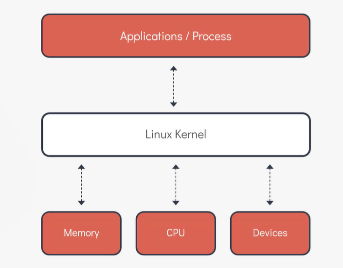
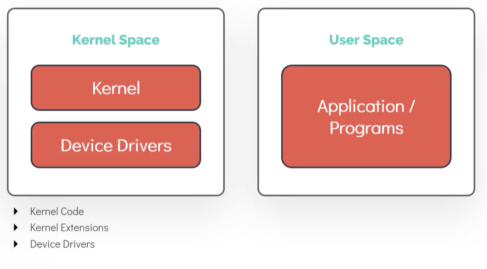
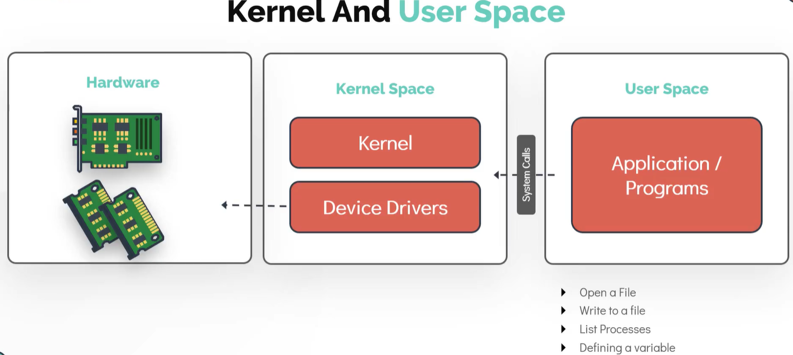
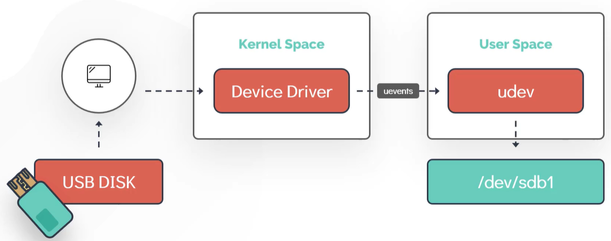
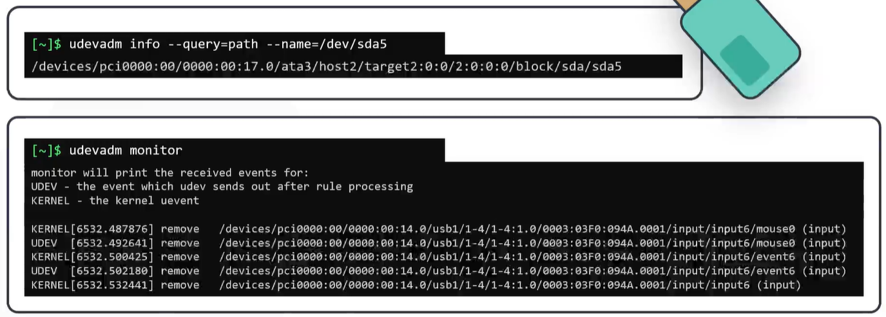
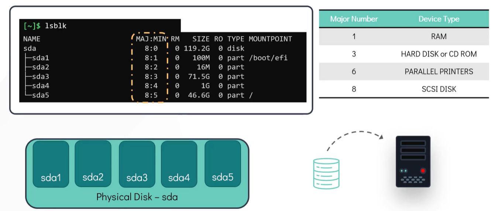

# The Linux Basics Course

* https://github.com/kodekloudhub/linux-basics-course

* Working with Shell
* Linux core concepts
* Package Management
* Shell & Bash
* Security and file permissions
* Linux Networking
* Storage in Linux
* SystemD and Services

# Working with Shell 

* REPL: Read-Eval-Print Loop
* Command, Argument, Options (aka. switches, flags)
* `echo Hello`, `echo -n Hello` omits the new line
* `uptime`
* Man pages: command help (manual)
* Command types: 
  * Internal: Are part of the shell itself and come bundled with it
    * There are around 30 internal commands
    * `echo`, `cd`, `pwd`, `mkdir`, `set`, ...
  * External: Are binary programs or scripts that are installed in different locations on the systems
    * They usually are installed using the Linux Distribution's package manager or can be created or installed by user
  * `type <command>` tells if a command is internal or external

## Basic Linux Commands

* `pwd`: present working directory, shows the current directory where you are
* `ls`
* `mkdir`: can create multiple directories in one command
  * `mkdir <dir1> <dir2> <dir3>`
  * `mkdir -p <dir1>/<dir1>/<dir3>`: creates the dir structure including parents
* `cd`, `cd ..`
* Absolute path vs relative path
* Root directory `\`
* `pushd <dir1>`: push current directory onto the `DIRSTACK` bash variable (the directory stack of remembered directories) and then changes to `dir1`
* `dirs`: shows the contents of `DIRSTACK`, the remembered directories
* `popd`: With  no  arguments,  removes  the  top directory  from  the stack, and performs a `cd` to the new top directory.
  
* `mv`: move or rename
* `cp`: copy
* `rm`: remove
* to copy or remove a dir use `-r` (for recursive) switch

* `cat <file>`: print content of the file
* `cat > <file>`: shows the prompt and you can type and the press `Ctrl-D` to write the content into the file
* `touch`: create a file
* Pagers: `more`, `less`:
  * space: scroll one page
  * enter: scroll one line
  * b: to go to previous pages
  * /: to search fo a pattern
  * q: to exit
  * `more` loads entire file at once, which might not be a good option
  * `less` also allows scrolling using arrow keys

* `ls -al`: long list, and show hidden files
* `ls -lt`: list all files sorted on last modified date, use `ls -ltr` for reverse order

## Getting Help

* `whatis`: displays a one line help of what a command does
* `man`: shows man pages of a command
* `--help`, `-h`: most commands have this option to show help
* `apropos`: searches through man page names and descriptions for a given keyword, useful when you want to look up all commands that contain a specific keyword

* https://github.com/kodekloudhub/linux-basics-course

## Bash Shell

* Bourne Shell (`sh`) developed in 1970s for Unix and still in use today, C Shell (`csh` or `tcsh`), Korn Shell (`ksh`), Z Shell (`zsh`), Bourne Again Shell (`bash`)
* Different shells may have different features and facilities, but they all serve the same goal: to facilitate communication between user and the operating system
* `echo $SHELL` shows the current (default) shell being used
* Bash is one of the most popular shells, because of the features like auto-completion and brace expansion which is not available in shells like Bourne Shell
* `chsh` to change the default shell; it takes effect when you open a new terminal

### Bash shell features:
* Auto-completion
* Aliases: `alias dt=date`
* History: `history`
* Environment variables: store information about user's login session that are used by the Shell when executing commands
  * e.g. `$SHELL` or `$HOME`
  * `env` to list all the environment variables
  * `export` to set a new environment variables, e.g. `export OFFICE=munich`; This will set the variable for the current shell or any other process started by the shell
  * You can also assign a variable with `export`, like simple `OFFICE=munich`. However this will only assign the variable within the shell and the value is not carried forward to any other process
  * to make the environment variables persistent over subsequent logins or reboots add them to `~/.profile` or `~/.pam_environment` file
  * `echo $LOGNAME`
  * `echo $TERM`

* `$PATH`: paths to search for the external commands
* `which` command to check if the location of a command can be identified
* `export PATH=$PATH:/opt/obj/bin` to extend the PATH

### Customizing the Bash Prompt
* `[~]$` bash prompt can be customized to show different information, for example the logged-in user and the host name
* The bash prompt is set and controlled by a set of specific environment variables, the most common of them is `$PS1` for primary prompt
* `echo $PS1`, prints for example `[\W]$` prints `[current working directory]$`
* check the documentation for different directives you can use in `$PS1` to change the prompt: 
  * `\d`: the date in Weekday Month Date format
  * `\e`: an ASCII escape character (033)
  * `\h`: the hostname HDQN
  * `\n`: new line
  * `\r`: carriage return
  * `\s`: the name of the shell
  * `\u`: username of the current user
  * `\w`: current working directory
  * `\$`: if effective UID is 0 prints a `#` otherwise a `$`

# Linux Core Concepts

## The Linux Kernel
* What is Linux Kernel and why it is important
* Kernel Space and User Space
* How Linux works with HW? How to user Kernel Modules
* Linux Boot Sequences
* Systemd Targets (Runlevels)
* Different file types and the File System hierarchy

### Kernel
* Kernel is a major component of the OS and is the interface between computer's HW and the processes running on it.

* The Kernel is responsible for four major tasks: 
  * Memory Management: Keep track of how much memory is available and how much is used to store what and where
  * Process Management: Determine which processes can use the CPU when and for how long
  * Device Drivers: Acts as in intermediary or interpreter between the HW and the processes
  * System Calls and Security: Receive requests for services from the processes

* The Linux kernel is _monolithic_: This means that the kernel caries out CPU Scheduling, Memory Management, and several other operations by itself
* The kernel is also _modular_: This means it can extend its capabilities through the use of dynamically loaded kernel modules

### Linux Kernel Versions
* Ways to identify Linux kernel versions and understand the naming conventions
* Use the `uname` command to display information about the kernel
  * `uname` simply does not provide much information. It only prints `Linux` meaning the system is using a Linux Kernel
  * Use `uname -r` or `uname -a` flag to provide the print the kernel version, for example `4.15.0-72-generic`. The `4.15.0` is the kernel, major, and minor version; `72` is the patch release or patch level; `generic` is a Distro specific additional Info. 
* The first Linux Kernel was developed by Linus Torvalds in 1991
* The latest release as of this recording is version `5.5.10` release on 18th March 2020
* All Linux distributions make use of any one of these kernel versions, for example Ubuntu 20.04, released in April 2020, uses the Linux kernel version 5 out of the box.
* Check out `http://kernel.org`. This is an open source project that hosts the repositories that make all versions of Linux kernel source code available to all users

### Kernel and User Space
* One of the major responsibilities of Linux Kernel is memory management
* Memory is separated into two areas: Kernel Space and User Space
  * These are synonymous to the terms Kernel Mode and User Mode
  * Kernel space is the portion of the memory in which the Kernel executes and provides its services
  * A process running in the kernel space has unrestricted access to the hardware 
  * Kernel space is strictly reserved to run kernel code, kernel extensions, and most device drivers
  * All process running outside of the kernel reside on the User Space
  * User Space has restricted access to the CPU and the memory

  

* Most Unix like Operating Systems, including Linux, come pre-packages with all sorts of programs, such as utilities, programming languages, graphical applications, etc. These are called User Space Applications. This is also often referred to "The User Land"
* Programs in the User Spaces make _system calls_ to the kernel to access hardware, such as memory and the disk. Examples of the system calls are memory allocation or opening a file
  

* Examples of some common system calls to access file system are `open()`, `close()`, `readdir()`, `strlen()`, `closedir()`

## Working with Hardware

* How Linux identifies and manages the HW while it is attached to the system
* List and get detailed information about the devices attached to the system from the command line
* Let's take the example of USB disk attached to the computer
  * As soon as the disk is attached to the system, a corresponding device driver, which is part of the kernel space, detects the state change and generates an event
  * This event, which is called a _uevent_ is then sent to the user space device manager called _udev_
  * The _udev_ service is then responsible for dynamically create a _device node_ associated with the newly attached drive in the `/dev/....` file system
  * When this process is complete, the newly attached disk must be visible under `/dev/...` file system

* Some ways to list and get detailed information about the HW attached to a Linux system:

* `dmesg` is a tool used to display messages from an area of the kernel called _ring buffer_ 
  * When a Linux OS boots up, there are numerous messages generated by the kernel
  * These messages also contain logs from the HW devices that the kernel detects and provide good indication whether it can configure them
  * You can redirect the output of `dmesg` using `less`, or search for specific keywords using `grep`
  * `dmesg | grep -i usb`

* `udevadm` is the management tool for udevs
  * `udevadm info` command queries the udev database for information about devices.
  * For example `udevadm info --query=pat --name=/dev/sda5` queries a hard disk attached to the system
  * `udevadm monitor` listens to the kernel uevents
  * Upon detecting and event, it prints the details such as the _device pat_ and _device name_ on the screen
  * This command is quite handy to determine the details of a newly attached or removed device
  * Example below shows when a USB mouse is removed from the system

* `lspci` lists and displays information about all the PCI devices connected and configured in the system
  * examples of PCI devices are ethernet cards, video cards, RAID controllers, wireless adapters

* `lsblk` lists information about _block devices_
  * For example below the `sda` is the physical disk; `sda1` to `sda5` are partitions created on this disk
  * In the output of `lsblk`, the TYPE `disk` is the physical disk and the type `part` is a partition
  * Also the `MAJ:MIN` are the major and minor numbers associated with each device. The major number identifies the type of device driver associated with the device. For example number `8` refers to a _block s disk_ device. The minor is used to differentiate between devices that are similar and have the same major number.
  * The table shows some of the commonly used devices along with their major numbers

* `lscpu` displays information about the CPU, such as architecture, socket number, number of cores, threads per core, vendor id, and model name
  * CPU(s) = sockets x cores per socket x threads per core

* `lsmem`

## Linux Boot Sequence

## Runlevels

## File Types

## File System Hierarchy

