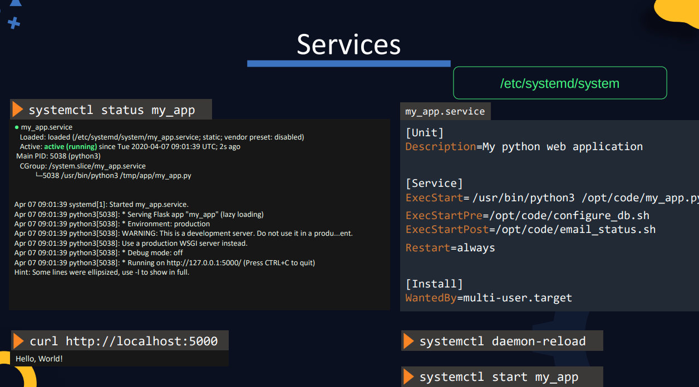

# DevOps Pre-requisites Course

* Linux basics
  * Linux CLI
  * VI editor
  * Package management
  * Service management
* Setup lab environment
  * Virtual Box, VMs, Multiple VMs, Networking and troubleshooting, Snapshots
* Linux networking basics
  * Interfaces
  * IP addresses
  * Routing
  * DNS
* SCM basics (git)
* Application basics
* Web servers
* Databases
  * MySQL
  * MongoDB
* Multi-tier applications
* JSON / YAML

# Linux Basics

* Most DevOps tools are either Linux-only (e.g. Ansible, K8s) or are first released and tested on Linux. 

* Linux CLI
* VI Editor
* Packages Management
* Service Management

* CentOS an open source community version of Red Hat Enterprise Linux (RHEL)
* In this course CentOS is used 

## Linux CLI

* GUI vs Command line
* Shell: Command line interface used to communicate with Linux
* Shell types:
    * Bourne Shell (Sh Shell)
    * C Shell (csh or tcsch)
    * Z Shell (zsh)
    * Bourne again Shell (bash)
    * The older Bourne Shell (or simply known as Shell) had many limitations; The newer bash shell supports many new features such as arithmetic operations, conditionals, etc. 
  * `echo $SHELL` command prints which shell we are using
  * `echo`
  * `ls`
  * `cd`
  * `pwd` (present working directory)
  * `mkdir`
  * use `;` to separate commands on the same line that are executed after each other. 
    * e.g. `cd new_directory; mkdir www; pwd`
  * `mkdir -p /tmp/asia/india/bangalore` create a directory tree
  * `rm -r /tmp/my_dir`
  * `cp -r my_dir /tmp/my_dir`

Working with files: 
* `touch new_file.txt`
* To add content to the new file: 
  * `cat > new_file.txt` (the `>` is called redirection)
  * the prompt will then wait for your input. You can add lines of text. 
  * Press `ctrl+D` to exit the `cat` prompt and save the data to the file.
* `cat new_file.txt` to view the content of the file

* `cp`
* `mv`
* `rm`

## VI Editor

* two modes: 
  * command mode (default when opening a file, press `Esc` key to switch to command mode from insert mode)
  * insert mode (type `i` to switch to insert mode)

## User Accounts

* `whoami`
* `id`
* `su <username>`: switch user
* `ssh <username@hostname>`
* `sudo`, SUDO users: `/etc/sudoers` file
  

## Download files: 

* `curl <url>`: prints the file to screen
* `curl <url> -O`: download and write the file
* `wget <url> -O <output_file>`: download and write the file

## Check OS Version
* `ls /etc/*release*`
* `cat /etc/*release*`

## Package Manager

* CentOS uses an RPM-based package manage like Red Hat Linux and Fedora
* RPM = RedHat Package Manager
* A software is packaged into a bundle with the extension `.rpm`
* `rpm -i telent.rpm` to install a package
* `rpm -e telent.rpm` uninstall package
* `rpm -q telnet.rpm` query the package DB and get details about an installed package
* `rpm` needs to point to the `.rpm` file and directly installs it, and does not care about any dependencies
* YUM is the high level package manager that uses RPM underneath
* `yum install ansible` installs Ansible and all its dependent packages
* YUM searches software repositories that contain thousands of packages and their dependencies 
* Software repositories can be local, securely inside enterprise, or publicly available in Internet
* When we install a package using YUM, it searches the repository and finds all the dependencies of that package and install them as well if they are not installed on the system.
* The information about repositories is at folder `/etc/yum.repos.d`
* Every OS is bundled with a default set of repositories. But sometimes the software we need is not available in the default repos. So we have to configure additional repos. 
* `yum repolist` list the repos
* `ls /etc/yum.repos.de` shows files where the repos are configured
* `cat /etc/yum.repos.d/CentOS-Base.repo` shows the content of a repo configuration, where the URL to the repo is stored.
* `yum install <repo-url>` installs a new repo
* `yum list <package-name>` list all the packages
* `yum remove <package-name>` removes a package
* `yum --showduplicates list <package-name>` lists all the different available versions of a package and the repository they reside on.
* `yum install <package-name-version>` installs a specific version of a package

## Services

* You want software (services) to run in the background, start as soon as the system is booted, start in a given order, ...
* Services in linux is used for this.
  * Run in background
  * Can start at system start
  * Can start in a given order
  * Restart if system crashes

* When any service software is installed, such as Docker, Webserver, etc, they are automatically installed as service. 
* `service httpd start` start a service
* `systemctl start httpd` starts a service using newer `systemctl` that is used to manage services on a **systemd** managed server
* Both commands serve the same purpose, and the `service` command uses the `systemctl` utility underneath
* `systemctl stop <service-name>`  stops the service
* `systemctl status <service-name>` check the status of a service
* `systemctl enable <service-name>` configure a service to start at startup
* `systemctl disable <service-name>` configure a service not to start at startup
* Once services are configured, it is very convenient to start and stop them. We don't need to go and find the executable and run it. 
* So, how do we configure an existing application as a service? so that we can use `systemctl` to start and stop and manage it?
* `systemctl` is used to manage the `systemd` services. So we have to configure our application as systemd service.
* A systemd service is configured as a **systemd unit file**
* These files maybe located at `/etc/systemd/system`
* The systemd unit file must be named as the desired service name (e.g. `my_app`) with a `.service` extension.
* Inside it, we can define a section `[Service]` with the directive `ExecStart=` where we provide the command that runs the application.
* run `systemctl daemon-reload` to let systemd know that there a new service configured. 
* then, run `systemctl start my_app` to run the service
* To configure the service to start at the system startup, add a section `[Install]` with the directive `WantedBy=` which should contain a name of a service that starts before this one at boot, e.g. `multi-user.target` 
* There are many other directives for the service unit config file:
  * `ExecStartPre=<command>` run the given command before running the service executable
  * `ExecStartPost=<command>` run the given command after the service is stopped
  * `Restart=always` to always restart the service if it crashes

## Virtual Machines

* Type 1 hypervisors (run on bare metal; VMWare ESXi or Microsoft Hyper-V) vs. Type 2 hypervisors (run on host OS; e.g. Oracle VirtualBox or VMWare Workstation)
* 