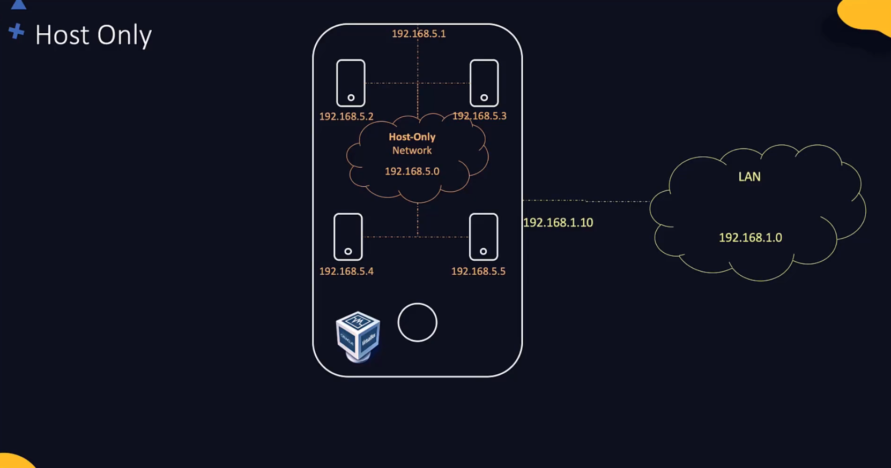
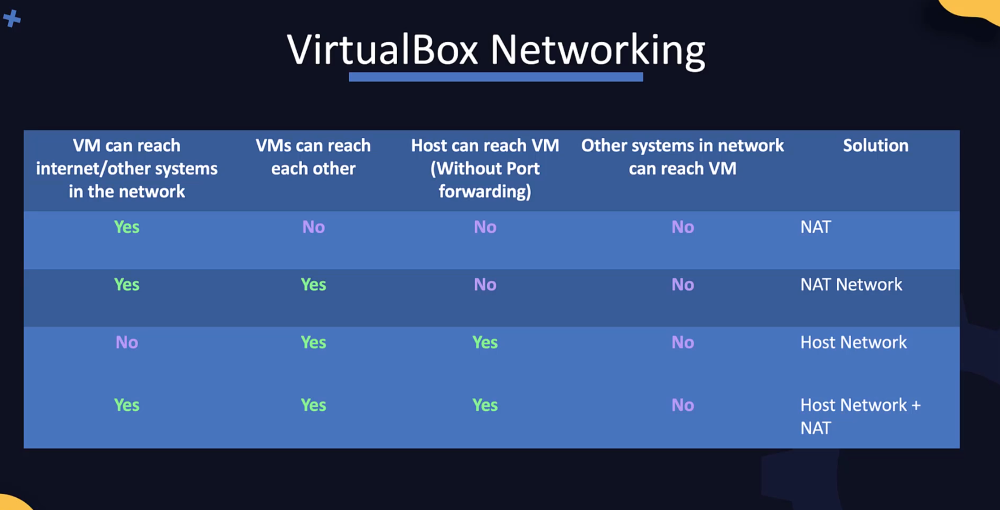

# DevOps Pre-requisites Course

* Linux basics
  * Linux CLI
  * VI editor
  * Package management
  * Service management
* Setup lab environment
  * Virtual Box, VMs, Multiple VMs, Networking and troubleshooting, Snapshots
* Linux networking basics
  * Interfaces
  * IP addresses
  * Routing
  * DNS
* SCM basics (git)
* Application basics
* Web servers
* Databases
  * MySQL
  * MongoDB
* Multi-tier applications
* JSON / YAML

# Linux Basics

* Most DevOps tools are either Linux-only (e.g. Ansible, K8s) or are first released and tested on Linux. 

* Linux CLI
* VI Editor
* Packages Management
* Service Management

* CentOS an open source community version of Red Hat Enterprise Linux (RHEL)
* In this course CentOS is used 

## Linux CLI

* GUI vs Command line
* Shell: Command line interface used to communicate with Linux
* Shell types:
    * Bourne Shell (Sh Shell)
    * C Shell (csh or tcsch)
    * Z Shell (zsh)
    * Bourne again Shell (bash)
    * The older Bourne Shell (or simply known as Shell) had many limitations; The newer bash shell supports many new features such as arithmetic operations, conditionals, etc. 
  * `echo $SHELL` command prints which shell we are using
  * `echo`
  * `ls`
  * `cd`
  * `pwd` (present working directory)
  * `mkdir`
  * use `;` to separate commands on the same line that are executed after each other. 
    * e.g. `cd new_directory; mkdir www; pwd`
  * `mkdir -p /tmp/asia/india/bangalore` create a directory tree
  * `rm -r /tmp/my_dir`
  * `cp -r my_dir /tmp/my_dir`

Working with files: 
* `touch new_file.txt`
* To add content to the new file: 
  * `cat > new_file.txt` (the `>` is called redirection)
  * the prompt will then wait for your input. You can add lines of text. 
  * Press `ctrl+D` to exit the `cat` prompt and save the data to the file.
* `cat new_file.txt` to view the content of the file

* `cp`
* `mv`
* `rm`

## VI Editor

* two modes: 
  * command mode (default when opening a file, press `Esc` key to switch to command mode from insert mode)
  * insert mode (type `i` to switch to insert mode)


## User Accounts

* `whoami`
* `id`
* `su <username>`: switch user
* `ssh <username@hostname>`
* `sudo`, SUDO users: `/etc/sudoers` file
  

## Download files: 

* `curl <url>`: prints the file to screen
* `curl <url> -O`: download and write the file
* `wget <url> -O <output_file>`: download and write the file

## Check OS Version
* `ls /etc/*release*`
* `cat /etc/*release*`

## Package Manager

* CentOS uses an RPM-based package manage like Red Hat Linux and Fedora
* RPM = RedHat Package Manager
* A software is packaged into a bundle with the extension `.rpm`
* `rpm -i telent.rpm` to install a package
* `rpm -e telent.rpm` uninstall package
* `rpm -q telnet.rpm` query the package DB and get details about an installed package
* `rpm` needs to point to the `.rpm` file and directly installs it, and does not care about any dependencies
* YUM is the high level package manager that uses RPM underneath
* `yum install ansible` installs Ansible and all its dependent packages
* YUM searches software repositories that contain thousands of packages and their dependencies 
* Software repositories can be local, securely inside enterprise, or publicly available in Internet
* When we install a package using YUM, it searches the repository and finds all the dependencies of that package and install them as well if they are not installed on the system.
* The information about repositories is at folder `/etc/yum.repos.d`
* Every OS is bundled with a default set of repositories. But sometimes the software we need is not available in the default repos. So we have to configure additional repos. 
* `yum repolist` list the repos
* `ls /etc/yum.repos.de` shows files where the repos are configured
* `cat /etc/yum.repos.d/CentOS-Base.repo` shows the content of a repo configuration, where the URL to the repo is stored.
* `yum install <repo-url>` installs a new repo
* `yum list <package-name>` list all the packages
* `yum remove <package-name>` removes a package
* `yum --showduplicates list <package-name>` lists all the different available versions of a package and the repository they reside on.
* `yum install <package-name-version>` installs a specific version of a package

## Services

* You want software (services) to run in the background, start as soon as the system is booted, start in a given order, ...
* Services in linux is used for this.
  * Run in background
  * Can start at system start
  * Can start in a given order
  * Restart if system crashes

* When any service software is installed, such as Docker, Webserver, etc, they are automatically installed as service. 
* `service httpd start` start a service
* `systemctl start httpd` starts a service using newer `systemctl` that is used to manage services on a **systemd** managed server
* Both commands serve the same purpose, and the `service` command uses the `systemctl` utility underneath
* `systemctl stop <service-name>`  stops the service
* `systemctl status <service-name>` check the status of a service
* `systemctl enable <service-name>` configure a service to start at startup
* `systemctl disable <service-name>` configure a service not to start at startup
* Once services are configured, it is very convenient to start and stop them. We don't need to go and find the executable and run it. 
* So, how do we configure an existing application as a service? so that we can use `systemctl` to start and stop and manage it?
* `systemctl` is used to manage the `systemd` services. So we have to configure our application as systemd service.
* A systemd service is configured as a **systemd unit file**
* These files maybe located at `/etc/systemd/system`
* The systemd unit file must be named as the desired service name (e.g. `my_app`) with a `.service` extension.
* Inside it, we can define a section `[Service]` with the directive `ExecStart=` where we provide the command that runs the application.
* run `systemctl daemon-reload` to let systemd know that there a new service configured. 
* then, run `systemctl start my_app` to run the service
* To configure the service to start at the system startup, add a section `[Install]` with the directive `WantedBy=` which should contain a name of a service that starts before this one at boot, e.g. `multi-user.target` 
* There are many other directives for the service unit config file:
  * `ExecStartPre=<command>` run the given command before running the service executable
  * `ExecStartPost=<command>` run the given command after the service is stopped
  * `Restart=always` to always restart the service if it crashes


## Virtual Machines

* Type 1 hypervisors (run on bare metal; VMWare ESXi or Microsoft Hyper-V) vs. Type 2 hypervisors (run on host OS; e.g. Oracle VirtualBox or VMWare Workstation)
* osboxes.org
* Start VM normally vs. **Headless** mode vs. **Detached** mode
* The VM needs to have an IP address configured and SSH needs to be running on it. We use console (normal mode) to configure it. After that we can start the VM in Headless mode and `ssh` to it from the host OS. 

### Check and set the IP addresses on a CentOS machine:

* Bridge network adapter (the VM is like an independent computer on the local network) vs. NAT adapter (the VM gets an IP address assigned by host and host does NAT; we also need to do port forwarding on the host to access the SSH port on the guest VM). 
* 
* `$ ip addr show` : Show network interfaces and their IP addresses
* With NAT adapter, the VM automatically gets a private IP assigned (`10.0.2.15/24`) by teh NAT router on the guest. This IP is not accessible from anywhere else. Neither from host nor from any other VM. 
* However, despite this private address, the VM should have internet connectivity through host (check by `ping google.com`)
* You can see the IP address using `$ ifconfig` 

* If the network interface (`enp0s3`) is not on at the boot, you can do `ifup enp0s3`. 
* If the network interface `enp0s3` is not on at the boot, you can make it always on at boot by adding `ONBOOT=yes` to `/etc/sysconfig/network-scripts/ifcfg-enp0s3` and making sure `NetworkManager` service starts at boot (`systemctl enable NetworkManager`)


* `$ ip addr add 192.168.1.10 dev eth0` : Set the IP address on a network card (here `eth0`)

### Check, configure and SSH to guest:
* The SSH service comes by default with the CentOS image. 
* `$ service sshd status` : Check the status of the SSH service
* `$ service sshd start` : Start SSH service
* If you are using NAT network adapter for the VM make sure you are forwarding any chose port from host to port `22` (SSH) of the guest. 
* SSH to guest from host: `$ ssh root@127.0.0.1 -p 2222` or with another user: `$ ssh osboxes@127.0.0.1 -p 2222`. The password for the os image can be found on the `osboxes.org` (default)

### VirtualBox Networking
* Networking options available in VirtualBox (NAT, Bridge, Host Only); which adapter to use when
* Troubleshooting internet connectivity on VMs
* Networking multiple VMs

* IP addresses are assigned to adapters (Ethernet, WLAN, ...)
* `ip addr show` shows the IP address assigned to each interface
* A host with multiple network adapters (Ethernet, WLAN) will have multiple IP addresses assigned to it, and other hosts can access it using any of these. Different adapters can also be connected to different networks and have for example internet connectivity or not, depending on the network they are connected to. 
* You can configure an VM in VirtualBox to have up to 4 adapters. Go to VM settings to Network tab.
* By default the VM have NAT adapter and a private IP address
* Imagine we have 4 VMs on our host, and host is itself connected to a network with the IP address `192.168.1.10`. We can create a virtual network on the host using the VM, for example with the IP address range `192.168.5.0`. The host itself gets a virtual adapter to connect to this network, with the IP address `192.168.5.1`. The VM on the network will get IP addresses like `192.168.5.2` to `192.168.5.5`. We call this network a "private virtual **Host Only network**".
  


* To create a private virtual host only network in VirtualBox go to host network manger. There you can define the network name, IP range, subnet mask, and if the DHCP server should be enabled. As soon as this private host only network is created, your host computer gets a virtual adapter (e.g. `vboxnet0`) connected to it (check with `ifconfig`)
* After crating the private network you can add VMs to it. Go to network settings of the VM and for the adapter select the created host only network in Attache to select Host-only Adapter. 

* The problem with the host-only network is that the VMs cannot connect to a computer outside the host-only network, e.g. to a DB server in the outer network, with the IP `192.168.1.11`
* In this case we should cerate a **NAT Network**. The VM get their IP addresses from the host, but now using the NAT server from the host, the can communicate to the outside world. However the outside world is not aware of the VMs due to network address translation in the host. 
* To create a NAT network, go to VirtualBox settings and create a NAT network. Then in the VM settings select the NAT Network for Attach to setting of the adapter. 
* Note that NAT Network is different from NAT (for Attach to setting). NAT is the default setting for a VM with VirtualBox. It also uses NAT router on the host. However it does not have the virtual networking. That is, the VM on the host that are attached to NAT, can't talk to each other. With the NAT Network, we have a virtual network with a NAT router. 

* Now how to let an external host (e.g `192.168.1.25`) access the VMs? For that you need to create a **Bridge Network**
* With Bridge network, the VMs get an IP in the range of external network. They are like hosts on the external real network, as if there is no virtual network on the host.

* Now what about internet connectivity in these three networking modes?
  * With NAT Network, the VM have access to internet through host
  * With bridge Network they are like normal hosts on the external network, so they have internet
  * With Host-only network however the VM cannot connect to internet. For that, we have to configure IP Forwarding on host computer, which is by default disabled on most computers. This essentially makes the host computer a router. Another option would be to configure a second adapter on the VMs, for example connected to a NAT Network.

* Consider also Port Forwarding in the above discussions. This is for example useful for the default case of adapter attached to NAT.


### Demo: Multiple VMs & Networking

* A good way to have multiple VM is to first create a base VM and them clone it (In VirtualBox right click on the VM and select clone)
* Different VirtualBox networking configuration, based on different requirements: 
  * If you want the VMs to have internet connectivity, but no need to talk to each other, then one **NAT** adapter is enough
  * If you want the VMs to have internet and be able to talk to each other, then user **NAT Network** as adapter type. You need to enable port forwarding to be able `ssh` into VMs
  * If you want the VM to talk to each other but no internet, then you can use **Host Only** network. The host can simply `ssh` into VMs. Each machine, including host itself, is part of a virtual network on the host. You can use DHCP to assign IP addresses to VMs automatically. 
  * If you want the VMs to talk to each other, and also have Internet, then you can enable two adapters on each VM (**NAT+Host Only**): One adapter set to NAT, gives us internet, the other adapter set to Host Network, connects the VM to the virtual network on the host. 
  * None of the above options makes your VMs visible to the external network nodes. They are hidden to outside world. If you want them to be accessible from outside world, then choose **Bridged** option. 



* TIP: Make a snapshot from your VM before making major changes. This way if something goes wrong, you can restore the snapshot version. 


### Vagrant
* In previous sections, we did multiple steps to configure our VMs:
  1. Download image
  2. Create VM
  3. Create Networks
  4. Configure Networking
  5. Configure Port Forwarding
  6. Boot up VM

* Vagrant helps us automate all these steps and do all the steps in one single `vagrant up` command
* This is specially useful when we are configuring a complex setup of multiple VMs together on different systems.

* To get started, download and install Vagrant from https://www.vagrantup.com/ 
* Once installed run `$ vagrant init` command and specify the name of the "box" you want to deploy. E.g. `$ vagrant init centos/7`
* A box is the name Vagrant uses to refer to a packaged format of an environment. It contains an image, and the scripts required to configure the environment. You can find existing boxes at https://app.vagrantup.com/boxes/search 
* Running `vagrant init` command initializes the Vagrant box in the current directory and creates a vagrant file. 
* The **Vagrantfile** has instructions on customizing your box
* To start the Vagrant box, run the `$ vagrant up`. This downloads the image required to create the VM. Downloads the VM, gives it a name, and applies any configuration, such as networking, and port forwarding that is specified in the Vagrantfile
* Run the `$ vagrant` command without any other options to see a list of available other commands, such as `init, up, suspend, resume, halt, destroy, status, reload, snapshot`
* You can also use `$ vagrant ssh` command to `ssh` into a running Vagrant box. Vagrant automatically identifies the port configured for forwarding and uses that for SSH
* A `Vagrantfile` starts with a configuration block. This is where we customize the VM configurations. We can then share this `Vagrantfile` with others and they will have an VM with exactly same configuration.
* In the simplest form, only a VM image is specified: 

```
Vagrant.configure("2") do |config|
  config.vm.box = "centos/7"


end
```

* We can do many other configurations in `Vagrantfile`, e.g.:

```
Vagrant.configure("2") do |config|
  config.vm.box = "centos/7"

  # configure port forwarding
  config.vm.network "forward_port", guest: 80, host:8080
  
  # configure a synced directory between host and VM
  config.vm.synced_folder "../data", "/vagrant_data"

  # configure the CPU and memory on the VM
  # for that you need a provider block
  config.vm.provider "virtualbox" do |vb|
    vb.memory = "1024"
  end

  # to run shell scripts use a shell provision block
  config.vm.provision "shell", inline: <<-SHELL
    apt-get update
    apt-get install -y apache2
  SHELL

end
```

* When we run `$ vagrant up` command with above configuration, the Vagrant provisions a VM followed the specification given in the file, and also runs the shell script given here.
* You can also include multiple VMs in `Vagrantfile`. This helps automating configuration of complex environments, such as small cluster, like Kubernetes clusters, on your laptop. 
* Vagrant uses Providers to abstract out creation and configuration of the the VMs. VirtualBox is only one of the existing providers. You can use Vagrant with VMWare, Hyper-V, or even Docker. 

### Demo: Vagrant

