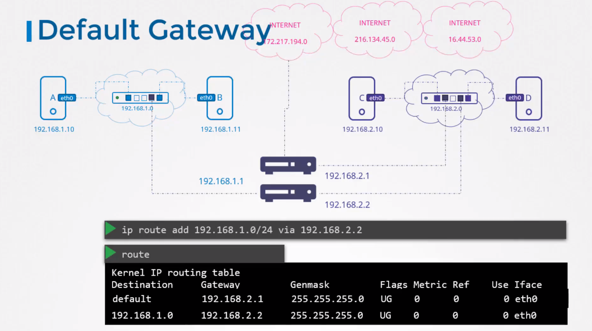
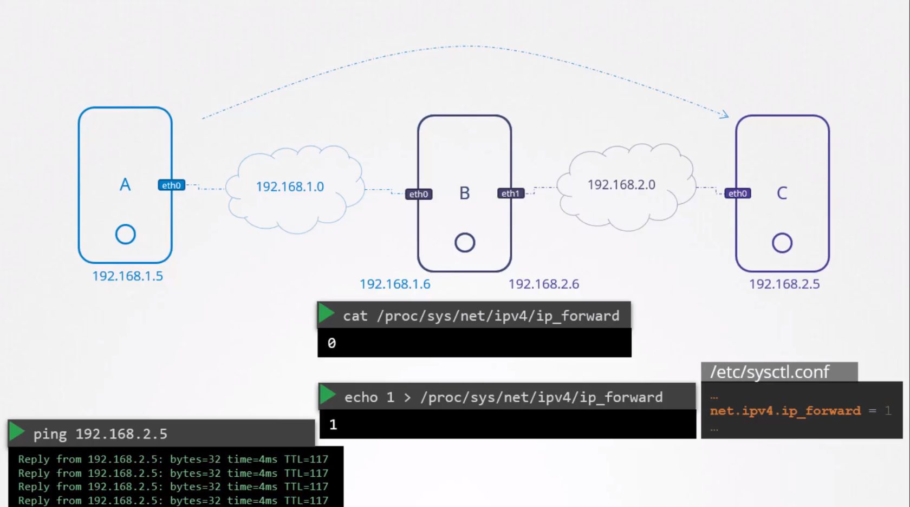
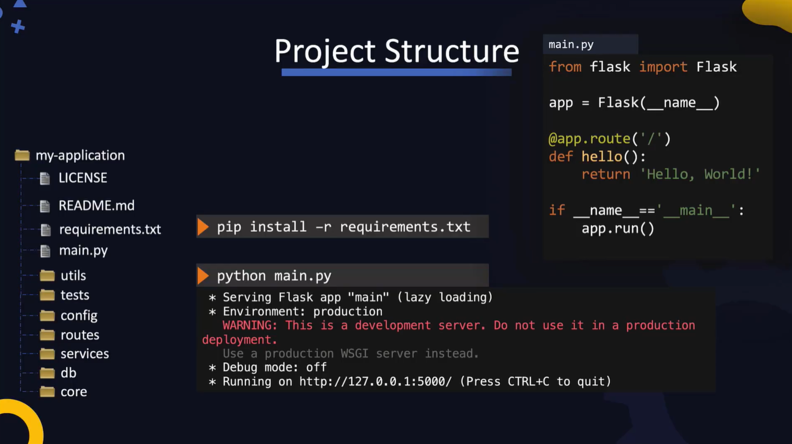
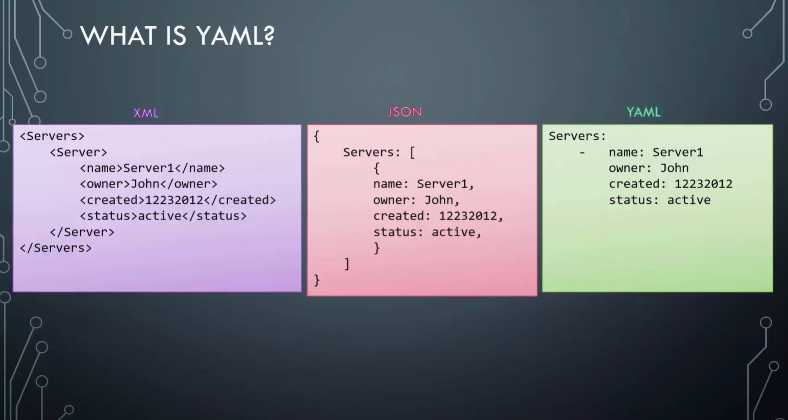

# DevOps Pre-requisites Course

* Linux basics
  * Linux CLI
  * VI editor
  * Package management
  * Service management
* Setup lab environment
  * Virtual Box, VMs, Multiple VMs, Networking and troubleshooting, Snapshots
* Linux networking basics
  * Interfaces
  * IP addresses
  * Routing
  * DNS
* SCM basics (git)
* Application basics
* Web servers
* Databases
  * MySQL
  * MongoDB
* Multi-tier applications
* JSON / YAML

# Linux Basics

* Most DevOps tools are either Linux-only (e.g. Ansible, K8s) or are first released and tested on Linux.

* Linux CLI
* VI Editor
* Packages Management
* Service Management

* CentOS an open source community version of Red Hat Enterprise Linux (RHEL)
* In this course CentOS is used

## Linux CLI

* GUI vs Command line
* Shell: Command line interface used to communicate with Linux
* Shell types:
    * Bourne Shell (Sh Shell)
    * C Shell (csh or tcsch)
    * Z Shell (zsh)
    * Bourne again Shell (bash)
    * The older Bourne Shell (or simply known as Shell) had many limitations; The newer bash shell supports many new features such as arithmetic operations, conditionals, etc.
  * `echo $SHELL` command prints which shell we are using
  * `echo`
  * `ls`
  * `cd`
  * `pwd` (present working directory)
  * `mkdir`
  * use `;` to separate commands on the same line that are executed after each other.
    * e.g. `cd new_directory; mkdir www; pwd`
  * `mkdir -p /tmp/asia/india/bangalore` create a directory tree
  * `rm -r /tmp/my_dir`
  * `cp -r my_dir /tmp/my_dir`

Working with files:
* `touch new_file.txt`
* To add content to the new file:
  * `cat > new_file.txt` (the `>` is called redirection)
  * the prompt will then wait for your input. You can add lines of text.
  * Press `ctrl+D` to exit the `cat` prompt and save the data to the file.
* `cat new_file.txt` to view the content of the file

* `cp`
* `mv`
* `rm`

## VI Editor

* two modes:
  * command mode (default when opening a file, press `Esc` key to switch to command mode from insert mode)
  * insert mode (type `i` to switch to insert mode)


## User Accounts

* `whoami`
* `id`
* `su <username>`: switch user
* `ssh <username@hostname>`
* `sudo`, SUDO users: `/etc/sudoers` file


## Download files:

* `curl <url>`: prints the file to screen
* `curl <url> -O`: download and write the file
* `wget <url> -O <output_file>`: download and write the file

## Check OS Version
* `ls /etc/*release*`
* `cat /etc/*release*`

## Package Manager

* CentOS uses an RPM-based package manage like Red Hat Linux and Fedora
* RPM = RedHat Package Manager
* A software is packaged into a bundle with the extension `.rpm`
* `rpm -i telent.rpm` to install a package
* `rpm -e telent.rpm` uninstall package
* `rpm -q telnet.rpm` query the package DB and get details about an installed package
* `rpm` needs to point to the `.rpm` file and directly installs it, and does not care about any dependencies
* YUM is the high level package manager that uses RPM underneath
* `yum install ansible` installs Ansible and all its dependent packages
* YUM searches software repositories that contain thousands of packages and their dependencies
* Software repositories can be local, securely inside enterprise, or publicly available in Internet
* When we install a package using YUM, it searches the repository and finds all the dependencies of that package and install them as well if they are not installed on the system.
* The information about repositories is at folder `/etc/yum.repos.d`
* Every OS is bundled with a default set of repositories. But sometimes the software we need is not available in the default repos. So we have to configure additional repos.
* `yum repolist` list the repos
* `ls /etc/yum.repos.de` shows files where the repos are configured
* `cat /etc/yum.repos.d/CentOS-Base.repo` shows the content of a repo configuration, where the URL to the repo is stored.
* `yum install <repo-url>` installs a new repo
* `yum list <package-name>` list all the packages
* `yum remove <package-name>` removes a package
* `yum --showduplicates list <package-name>` lists all the different available versions of a package and the repository they reside on.
* `yum install <package-name-version>` installs a specific version of a package

## Services

* You want software (services) to run in the background, start as soon as the system is booted, start in a given order, ...
* Services in linux is used for this.
  * Run in background
  * Can start at system start
  * Can start in a given order
  * Restart if system crashes

* When any service software is installed, such as Docker, Webserver, etc, they are automatically installed as service.
* `service httpd start` start a service
* `systemctl start httpd` starts a service using newer `systemctl` that is used to manage services on a **systemd** managed server
* Both commands serve the same purpose, and the `service` command uses the `systemctl` utility underneath
* `systemctl stop <service-name>`  stops the service
* `systemctl status <service-name>` check the status of a service
* `systemctl enable <service-name>` configure a service to start at startup
* `systemctl disable <service-name>` configure a service not to start at startup
* Once services are configured, it is very convenient to start and stop them. We don't need to go and find the executable and run it.
* So, how do we configure an existing application as a service? so that we can use `systemctl` to start and stop and manage it?
* `systemctl` is used to manage the `systemd` services. So we have to configure our application as systemd service.
* A systemd service is configured as a **systemd unit file**
* These files maybe located at `/etc/systemd/system`
* The systemd unit file must be named as the desired service name (e.g. `my_app`) with a `.service` extension.
* Inside it, we can define a section `[Service]` with the directive `ExecStart=` where we provide the command that runs the application.
* run `systemctl daemon-reload` to let systemd know that there a new service configured.
* then, run `systemctl start my_app` to run the service
* To configure the service to start at the system startup, add a section `[Install]` with the directive `WantedBy=` which should contain a name of a service that starts before this one at boot, e.g. `multi-user.target`
* There are many other directives for the service unit config file:
  * `ExecStartPre=<command>` run the given command before running the service executable
  * `ExecStartPost=<command>` run the given command after the service is stopped
  * `Restart=always` to always restart the service if it crashes


# Setup lab environment

## Virtual Machines

* Type 1 hypervisors (run on bare metal; VMWare ESXi or Microsoft Hyper-V) vs. Type 2 hypervisors (run on host OS; e.g. Oracle VirtualBox or VMWare Workstation)
* osboxes.org
* Start VM normally vs. **Headless** mode vs. **Detached** mode
* The VM needs to have an IP address configured and SSH needs to be running on it. We use console (normal mode) to configure it. After that we can start the VM in Headless mode and `ssh` to it from the host OS.

### Check and set the IP addresses on a CentOS machine:

* Bridge network adapter (the VM is like an independent computer on the local network) vs. NAT adapter (the VM gets an IP address assigned by host and host does NAT; we also need to do port forwarding on the host to access the SSH port on the guest VM).
*
* `$ ip addr show` : Show network interfaces and their IP addresses
* With NAT adapter, the VM automatically gets a private IP assigned (`10.0.2.15/24`) by teh NAT router on the guest. This IP is not accessible from anywhere else. Neither from host nor from any other VM.
* However, despite this private address, the VM should have internet connectivity through host (check by `ping google.com`)
* You can see the IP address using `$ ifconfig`

* If the network interface (`enp0s3`) is not on at the boot, you can do `ifup enp0s3`.
* If the network interface `enp0s3` is not on at the boot, you can make it always on at boot by adding `ONBOOT=yes` to `/etc/sysconfig/network-scripts/ifcfg-enp0s3` and making sure `NetworkManager` service starts at boot (`systemctl enable NetworkManager`)


* `$ ip addr add 192.168.1.10 dev eth0` : Set the IP address on a network card (here `eth0`)

### Check, configure and SSH to guest:
* The SSH service comes by default with the CentOS image.
* `$ service sshd status` : Check the status of the SSH service
* `$ service sshd start` : Start SSH service
* If you are using NAT network adapter for the VM make sure you are forwarding any chose port from host to port `22` (SSH) of the guest.
* SSH to guest from host: `$ ssh root@127.0.0.1 -p 2222` or with another user: `$ ssh osboxes@127.0.0.1 -p 2222`. The password for the os image can be found on the `osboxes.org` (default)

### VirtualBox Networking
* Networking options available in VirtualBox (NAT, Bridge, Host Only); which adapter to use when
* Troubleshooting internet connectivity on VMs
* Networking multiple VMs

* IP addresses are assigned to adapters (Ethernet, WLAN, ...)
* `ip addr show` shows the IP address assigned to each interface
* A host with multiple network adapters (Ethernet, WLAN) will have multiple IP addresses assigned to it, and other hosts can access it using any of these. Different adapters can also be connected to different networks and have for example internet connectivity or not, depending on the network they are connected to.
* You can configure an VM in VirtualBox to have up to 4 adapters. Go to VM settings to Network tab.
* By default the VM have NAT adapter and a private IP address
* Imagine we have 4 VMs on our host, and host is itself connected to a network with the IP address `192.168.1.10`. We can create a virtual network on the host using the VM, for example with the IP address range `192.168.5.0`. The host itself gets a virtual adapter to connect to this network, with the IP address `192.168.5.1`. The VM on the network will get IP addresses like `192.168.5.2` to `192.168.5.5`. We call this network a "private virtual **Host Only network**".


* To create a private virtual host only network in VirtualBox go to host network manger. There you can define the network name, IP range, subnet mask, and if the DHCP server should be enabled. As soon as this private host only network is created, your host computer gets a virtual adapter (e.g. `vboxnet0`) connected to it (check with `ifconfig`)
* After crating the private network you can add VMs to it. Go to network settings of the VM and for the adapter select the created host only network in Attache to select Host-only Adapter.

* The problem with the host-only network is that the VMs cannot connect to a computer outside the host-only network, e.g. to a DB server in the outer network, with the IP `192.168.1.11`
* In this case we should cerate a **NAT Network**. The VM get their IP addresses from the host, but now using the NAT server from the host, the can communicate to the outside world. However the outside world is not aware of the VMs due to network address translation in the host.
* To create a NAT network, go to VirtualBox settings and create a NAT network. Then in the VM settings select the NAT Network for Attach to setting of the adapter.
* Note that NAT Network is different from NAT (for Attach to setting). NAT is the default setting for a VM with VirtualBox. It also uses NAT router on the host. However it does not have the virtual networking. That is, the VM on the host that are attached to NAT, can't talk to each other. With the NAT Network, we have a virtual network with a NAT router.

* Now how to let an external host (e.g `192.168.1.25`) access the VMs? For that you need to create a **Bridge Network**
* With Bridge network, the VMs get an IP in the range of external network. They are like hosts on the external real network, as if there is no virtual network on the host.

* Now what about internet connectivity in these three networking modes?
  * With NAT Network, the VM have access to internet through host
  * With bridge Network they are like normal hosts on the external network, so they have internet
  * With Host-only network however the VM cannot connect to internet. For that, we have to configure IP Forwarding on host computer, which is by default disabled on most computers. This essentially makes the host computer a router. Another option would be to configure a second adapter on the VMs, for example connected to a NAT Network.

* Consider also Port Forwarding in the above discussions. This is for example useful for the default case of adapter attached to NAT.


### Demo: Multiple VMs & Networking

* A good way to have multiple VM is to first create a base VM and them clone it (In VirtualBox right click on the VM and select clone)
* Different VirtualBox networking configuration, based on different requirements:
  * If you want the VMs to have internet connectivity, but no need to talk to each other, then one **NAT** adapter is enough
  * If you want the VMs to have internet and be able to talk to each other, then user **NAT Network** as adapter type. You need to enable port forwarding to be able `ssh` into VMs
  * If you want the VM to talk to each other but no internet, then you can use **Host Only** network. The host can simply `ssh` into VMs. Each machine, including host itself, is part of a virtual network on the host. You can use DHCP to assign IP addresses to VMs automatically.
  * If you want the VMs to talk to each other, and also have Internet, then you can enable two adapters on each VM (**NAT+Host Only**): One adapter set to NAT, gives us internet, the other adapter set to Host Network, connects the VM to the virtual network on the host.
  * None of the above options makes your VMs visible to the external network nodes. They are hidden to outside world. If you want them to be accessible from outside world, then choose **Bridged** option.


* TIP: Make a snapshot from your VM before making major changes. This way if something goes wrong, you can restore the snapshot version.


### Vagrant
* In previous sections, we did multiple steps to configure our VMs:
  1. Download image
  2. Create VM
  3. Create Networks
  4. Configure Networking
  5. Configure Port Forwarding
  6. Boot up VM

* Vagrant helps us automate all these steps and do all the steps in one single `vagrant up` command
* This is specially useful when we are configuring a complex setup of multiple VMs together on different systems.

* To get started, download and install Vagrant from https://www.vagrantup.com/
* Once installed run `$ vagrant init` command and specify the name of the "box" you want to deploy. E.g. `$ vagrant init centos/7`
* A box is the name Vagrant uses to refer to a packaged format of an environment. It contains an image, and the scripts required to configure the environment. You can find existing boxes at https://app.vagrantup.com/boxes/search
* Running `vagrant init` command initializes the Vagrant box in the current directory and creates a vagrant file.
* The **Vagrantfile** has instructions on customizing your box
* To start the Vagrant box, run the `$ vagrant up`. This downloads the image required to create the VM. Downloads the VM, gives it a name, and applies any configuration, such as networking, and port forwarding that is specified in the Vagrantfile
* Run the `$ vagrant` command without any other options to see a list of available other commands, such as `init, up, suspend, resume, halt, destroy, status, reload, snapshot`
* You can also use `$ vagrant ssh` command to `ssh` into a running Vagrant box. Vagrant automatically identifies the port configured for forwarding and uses that for SSH
* A `Vagrantfile` starts with a configuration block. This is where we customize the VM configurations. We can then share this `Vagrantfile` with others and they will have an VM with exactly same configuration.
* In the simplest form, only a VM image is specified:

```
Vagrant.configure("2") do |config|
  config.vm.box = "centos/7"


end
```

* We can do many other configurations in `Vagrantfile`, e.g.:

```
# -*- mode: ruby -*-
# vi: set ft=ruby :

# All Vagrant configuration is done below. The "2" in Vagrant.configure
# configures the configuration version (we support older styles for
# backwards compatibility). Please don't change it unless you know what
# you're doing.
Vagrant.configure("2") do |config|
  # The most common configuration options are documented and commented below.
  # For a complete reference, please see the online documentation at
  # https://docs.vagrantup.com.

  # Every Vagrant development environment requires a box. You can search for
  # boxes at https://vagrantcloud.com/search.
  config.vm.box = "centos/7"

  # Disable automatic box update checking. If you disable this, then
  # boxes will only be checked for updates when the user runs
  # `vagrant box outdated`. This is not recommended.
  # config.vm.box_check_update = false

  # Create a forwarded port mapping which allows access to a specific port
  # within the machine from a port on the host machine. In the example below,
  # accessing "localhost:8080" will access port 80 on the guest machine.
  # NOTE: This will enable public access to the opened port
  # config.vm.network "forwarded_port", guest: 80, host: 8080

  # Create a forwarded port mapping which allows access to a specific port
  # within the machine from a port on the host machine and only allow access
  # via 127.0.0.1 to disable public access
  # config.vm.network "forwarded_port", guest: 80, host: 8080, host_ip: "127.0.0.1"

  # Create a private network, which allows host-only access to the machine
  # using a specific IP.
  # config.vm.network "private_network", ip: "192.168.33.10"

  # Create a public network, which generally matched to bridged network.
  # Bridged networks make the machine appear as another physical device on
  # your network.
  # config.vm.network "public_network"

  # Share an additional folder to the guest VM. The first argument is
  # the path on the host to the actual folder. The second argument is
  # the path on the guest to mount the folder. And the optional third
  # argument is a set of non-required options.
  # config.vm.synced_folder "../data", "/vagrant_data"

  # Provider-specific configuration so you can fine-tune various
  # backing providers for Vagrant. These expose provider-specific options.
  # Example for VirtualBox:
  #
  # config.vm.provider "virtualbox" do |vb|
  #   # Display the VirtualBox GUI when booting the machine
  #   vb.gui = true
  #
  #   # Customize the amount of memory on the VM:
  #   vb.memory = "1024"
  # end
  #
  # View the documentation for the provider you are using for more
  # information on available options.

  # Enable provisioning with a shell script. Additional provisioners such as
  # Ansible, Chef, Docker, Puppet and Salt are also available. Please see the
  # documentation for more information about their specific syntax and use.
  # config.vm.provision "shell", inline: <<-SHELL
  #   apt-get update
  #   apt-get install -y apache2
  # SHELL
end

```

* When we run `$ vagrant up` command with above configuration, the Vagrant provisions a VM followed the specification given in the file, and also runs the shell script given here.
* You can also include multiple VMs in `Vagrantfile`. This helps automating configuration of complex environments, such as small cluster, like Kubernetes clusters, on your laptop.
* Vagrant uses Providers to abstract out creation and configuration of the the VMs. VirtualBox is only one of the existing providers. You can use Vagrant with VMWare, Hyper-V, or even Docker.

### Demo: Vagrant

* Download and install from vagrantup.com
* Create a directory and inside it run `$ vagrant init centos/7`. This creates a `Vagrantfile` for the CentOS image in the directory.
* You can edit this `Vagrantfile` to change configurations.
* Run `$ vagrant up` command to download the image into provider's (in our case VirtualBox) default VM folder, and create the VirtualBox according to the configuration, and boots it up. If you open the VirtualBox, you see the VM running.
* We can now even simply SSH into the VM using `$ vagrant ssh`
* Use `$ vagrant status` to see the status of the VM
* Use `$ vagrant halt` to shutdown the VM
* We can change the settings of the VM, like its name, in the `Vagrantfile`. For changes to take effect use `$ vagrant reload` command
* `$ vagrant up` waits for the VM to boot up. If the VM has few resources, or has other configuration that makes it booting take longer, then an error might appear indicating a time out. However if the VM boots successfully, you can access it despite this error. But if you want to get rid of this error you can add a configuration to Vagrantfile: `config.vm.boot_timeout = 600` ms


# Networking Basics
* Switching
* Routing
* Default Gateway
* DNS Configuration on Linux

## Switching
* We can connect two or more computers using a **Switch** to create a network. The computers are connected using their network interfaces to the switch. Each interface will have an IP address.
* To see interfaces on a host: `$ ip link`
* To assign ip address to a host: `$ ip addr 192.168.1.10/24 dev eth0`
* A switch can only connect computers on the same network (e.g. `192.168.1.0`), for example imagine we have a network of two computers `A`, with IP address `192.168.1.10` and `B` with IP address `192.168.1.11` connected through a switch to the network `192.168.1.0`
* Now imagine we have another networks with address `192.168.2.0` with two computers `C` with IP address `192.168.2.10` and `D` with IP address `192.168.2.11`.
* Now how do we connect computer B (`192.168.1.11`) from first network to computer C (`192.168.2.10`) of other network? This is the job of a **Router**

## Routing and Gateway
* A Router is an intelligent device that helps us connect two different networks. Think of it as a server (computer) with many different network interfaces.
* In our above example, since the router is connected to two separate networks, it gets assigned two separate IP addresses, one for each network. E.g. `192.168.1.1` for the first network, and `192.168.2.1` for the second network.
* Now, when system B in the first network, wants to send a packet to system C in the second network, how does it know where is the Router? the Router is just another device, connected to the network, there might be tens of different devices connected to the same networks
* This is where we configure the systems with a **Gateway** or a Route. Think of it, if the network was a room, the Gateway is its door to the outside world: to other networks, to internet, etc.
* The systems need to know where that door is, to go through that.
* To see the existing **routing configuration** run: `$ route` command

```
[root@osboxes ~]# route
Kernel IP routing table
Destination     Gateway         Genmask         Flags Metric Ref    Use Iface
default         _gateway        0.0.0.0         UG    100    0        0 enp0s3
10.0.2.0        0.0.0.0         255.255.255.0   U     100    0        0 enp0s3
192.168.57.0    0.0.0.0         255.255.255.0   U     101    0        0 enp0s8
192.168.122.0   0.0.0.0         255.255.255.0   U     0      0        0 virbr0
```

* Now for computer B on `192.168.1.0` network to connect to computer C on `192.168.2.0` network, we need to tell it where the Gateway is:
* `B$ ip route add 192.168.2.0/24 via 192.168.1.1`
* This command specifies on computer B that to access network `192.168.2.0` use the Gateway at `192.168.1.1`
* Now, this has to be configured on all the systems. For example for C to access B, we need to configure the gateway: `C$ ip route add 192.168.1.0/24 via 192.168.2.1`
* Also if we want to for example access a Google server on the Internet at network `172.217.194.0`, then we need to connect the Router to the internet and configure on all computers the route using e.g. on B: `B$ ip route add 172.217.194.0 via 192.168.1.1`
* This is not practical though, as there are so many other computers on Internet and in other networks. Therefore we define a **default Gateway**. This way instead of adding a routing table entry for each network, we would say, for any network that you don't know a route to, use this router as the **default Gateway**
* To define the default gateway: `$ ip route add default via 192.168.1.1`
* Instead of the word `default` we can says `0.0.0.0`. This means "any IP destination"
* A `0.0.0.0` entry as the Gateway, means to access the destination, you don't need a gateway. For example for system C to access system D, both on `192.168.2.0` network
* Now imagine we have two Routers on our network. One for the internet, another of the internal private network. Then you will need two separate entries in your Routing table: One entry for the internal private network and another one with the default gateway for all other public networks on the internet.
* So if you are having issues reaching internet from your system, this routing table and the default Gateway configuration is good place to start.




### Setting a Linux Host as a Simple Router

* Imagine we have three nodes: A, B, C, with A and B on `192.168.1.0` network, and B and C on `192.168.2.0` network. So, B is on both networks, and we can use it as the router.
* At first if we `ping` C from A, we get `Connect: Network unreachable` error. Because A does not know how to reach C in the other network.
* We add routing entries on A and C to reach each other via B (`192.168.1.6` on first network and `192.168.2.6` on second network):
  * On A `$ ip route add 192.168.2.0/24 via 192.168.1.6`
  * On C `$ ip route add 192.168.1.0/24 via 192.168.2.6`

* But the pings still don't work. This is because, although B has two network interfaces (`eth0` connected to first network and `eth1` connected to second network), but it does not forward packets by default between interfaces. This is because an obvious security reason disabled by default on Linux (reason: imagine you have host with two interfaces, one connected two Internet and one to the private network. Then it would be possible for other computers on the Internet to send packets to the private network)
* This setting is in file `/proc/sys/net/ipv4/ip_forward`. By default this value is `0`
* To persistently setting it to `1` we need to set the same values in the `/etc/sysctl.conf`: `net.ipv4.ip_forward = 1`




### Summary: Key Networking Commands
* `$ ip link` to list and modify interfaces on the host
* `$ ip addr` to see ip addresses assigned to those interfaces
* `$ ip addr add 192.168.1.10/24 dev eth0` to set IP address for an interface
* REMEMBER: Changes made by these commands is only valid till reboot. To persist them, you need to set them in the `/etc/network/interfaces` file
* `$ route` or `$ ip route` is used to see the routing table
* `$ ip route add 192.168.1.0/24 via 192.168.2.1` is used to used to add entries to routing table
* `$ cat /proc/sys/net/ipv4/ip_forward` to check if **ip forwarding** is enabled on a host, if you are working with a host configured as a router.

## DNS

* Imagine we have two systems A, with IP address `192.168.1.10` and B with IP address `192.168.1.11` connected to the network `192.168.1.0`. We run a DB on computer B and we want to name it "db".
* `/etc/hosts` file contains host names for ip addresses. A look up on `/etc/hosts` file and finding the IP address for a given name is called **name resolution**
```
# /etc/hosts
192.168.1.11     db
```

* NOTE: What ever is written in `/etc/hosts` file is the source of truth. For example system A does not check if the real name of the computer at `192.168.1.11` is db. For example running `hostname` command on computer B, reveals that it's name is `host-2`, but host A does not care, it knows host B as 'db' per `/etc/hosts` files.
* This way, we may even be able to fool system A to think the address `192.168.1.11` is Google by adding a corresponding entry in `/etc/hosts` file
* It used to be the case, that on each computer on the network the `hosts` file would contain the names and IP addresses of the every other computer on the network. But this was not scalable, since adding a new name to the network, would mean editing all the `/etc/hosts` files on every node.
* So instead a separate central server would keep this list of host names. This is called a **Name Server**
* All hosts on the network now look up the name server for resolving the IP addresses from names.
* `/etc/resolv.conf` contains the IP address of the DNS server.
* The `/etc/hosts` file still can be used locally on each computer, and gets precedence in name resolution over the DNS server.
* The look up order is by default `/etc/hosts` file then DNS server. This can be defined in the file `/etc/nsswitch.conf`, at the lines with `hosts` entry.
* The `/etc/resolv.conf` can contain multiple name server addresses configured. For example `8.8.8.8` is a well known public DNS server hosted by Google. We can also configure the DNS server itself to forward any unknown name to a specific nameserver on the Internet.

### Domain Name
* The address `www.google.com` is a domain name: `.` is the root, `.com` is the top-level domain, `google` is the organization name, and `www` is the sub-domain's name
* Name resolutions maybe done by forwarding DNS requests to different servers. For example, if your local host looks up `app.google.com`, this request is first sent to your organization's DNS server. If it is not known, the request is forwarded to the root DNS server, which may then forward it to `.com` DNS server, which may forward it to Google's DNS server, and so on.
* To avoid forwarding requests every time, which takes time, your organization's DNS server might cache the results
* The `search` entry in `/etc/resolv.conf` appends this postfix to name local name lookups

### DNS Record Types
* Record types describe how are the records stored in the DNS server.
* `A` records: Store IPv4 addresses to host names
* `AAAA` records (quad A records): store IPv6 addresses to host names
* `CNAME` records: map one name to another, like multiple aliases, like mapping eat.web-server and hungary.web-server to food.web-server.
* Now, `ping` may not always be the right tool to test DNS resolution.
* You can use `nslookup` to query a host name from a DNS server. NOTE: `nslookup` does not consider entries in the local `hosts` file. `nslookup` only queries the nameserver
* `dig` is another tool for testing DNS name resolutions. It also only queries the name server. It returns more details in a similar form as stored on the nameserver.


# Applications Basics
* compile, build, package, and deploy applications written in JavaScript, Java, and Python

* compiled vs. interpreted languages

* source code, byte code, machine code, compiler

* `.pyc` files contain python byte code

* Python or Java virtual machine translate byte code into machine code at runtime

* packages, libraries, dependencies, package managers (`pip`, `npm`)

* compile, test, package, deliver: CI/CD pipelines

## Java
* one of the most-widely used languages for building desktop, mobile, and web applications
* latest version currently (2019) is Java 13
* a lot of organizations are still stock at version 8 though; because version 9 introduced a lot of changes that made many popular tools and libraries incompatible; also some changes in licensing terms prevented companies from upgrading their applications

* `java -version`
* JDK: a set of tools to develop, build, and run Java applications: `jdb`, `javadoc`, `javac`, `jar`
* JRE: needed runtime environment to run java programs on any system

* `javac` compile `MyClass.java` and generates a `MyClass.class` file
* `java MyClass` run the application
* Packaging using JAR `jar cf MyApp.jar MyClass.class Service1.class Service2.class ...`
  * automatically generates a `META-INF/MANIFEST.MF` file containing information about the `.jar` file, like the entry point of the application (main class) and any other metadata about the application
* To run the packaged application `java -jar MyApp.jar`
* Generate documentation: `javadoc -d doc MyClass.java`
* Build process: Compile, Test, Package, Document, ...
* Build process can become very complicated for a large project
  * Build tools like Maven, Gradle, ANT make managing this process easier using configuration files in which we specify the build steps and their corresponding tasks.
  * See for example "targets" in `build.xml` of ANT and their dependencies among each other
  * like `ant compile jar`
  * or `pom.xml` files of Maven
  * or `build.gradle` of Gradle

## NodeJS
* JavaSCript is the technology that made building modern dynamic web applications possible
* JS paved the ways for various "client-side" view frameworks, like jQuery, AngularJS, ReactJS, Vue.js.
  * Remember that all of these are client-side frameworks; they don't have anything to do the the back-end code
  * In the past, the backend would be programmed in Java, Ruby, Python, but not with JS
* NodeJS took the JS out of the browser and made it possible to create backends such as web services using JS.
* NodeJS has the distinguishing feature of the ability to handle a large number of concurrent connections using its **non-blocking IO** model
* It is open source and free and compatible with different platforms
* Currently the latest version of NodeJS is 13

* `node -v` show version of installed NodeJS
* `node my_program.js` to run your JS application
* NPM is the package manager of NodeJS; the default public repository is `npmjs.com`
* `npm -v` shows the version of NPM. NPM CLI utility is used to interact with the NPM repository
* `npm search <some_package>` search and show information about a package
* `npm install <package>`
  * npm installs packages in a directory called `node_modules` under the current directory
  * a directory with the name of the package containing license, readme, code (under `lib` folder) is created
  * this folder also contains the `package.json` file which contains information about the package such as its version and author, dependencies, etc.
* You can install package either in the current directory, or globally on the system
* To use a package you can import it into your own code using e.g. `var file = require("file")`. This import the `file` package into your code and you can use it, for example `file.mkdirs("/tmp/dir1")`
  * When we import a package, Node first looks under `node_modules` directory to see it finds the package
  * If not, it looks in the global package dir of the system
  * `node -e "console.log(module.paths)"` prints the module paths that `node` looks up.
* To install a package globally: `npn install <package> -g`
* Two types of modules:
  * Built-in modules are installed automatically when NodeJS is installed. They are under `/usr/lib/node_modules/npm/node_modules`; Examples are
    *  `fs` to handle file system
    *  `http` to host and HTTP server
    *  `os` to work with OS
    *  `events` to handle events
    *  `tls` for TLS and SSL
    *  `url` for parsing and working with URLs
  * External modules are located in `/usr/lib/node_modules`; Examples are
    * `express` a popular web app framework
    * `react` to create UIs
    * `debug` to debug applications
    * `async` to work with async JS

* `package.json` lists the dependencies of the application along their versions; it is important that these versions are specified properly and installed

## Python

* Free and open source cross platform programming language
* To run Python programs we need the Python Interpreter
* Python2 (2000-2010) vs. Python3 (2008-present)
  * Python3 is not compatible backward compatible with Python2
  * Python2 application must run on the Python 2 interpreter
  * You can have both versions installed in a system at the same time `python2` command vs `python3` command

* `which python`
* `python2 --version`
* `python my_app.py` runs the program

* PIP is the package manager for python. It is installed along with Python
* Similar to Python interpreter, you may have two versions of PIP `pip2` vs `pip3` installed
* `pip -V` will tell you the version of the PIP and the corresponding Python version
* `pip install <package>` to install a package, e.g. `pip install flask`

* When python is installed it creates the folder `/usr/lib/python2.7/site-packages` or `/usr/lib/python3.6/site-packages` where the packages are installed; with separate paths for 32 bit or 64 bit packages
* `pip show <package>` shows information about an installed package, including where it is installed

* To import a package you use `import <package_name>` in your code
* To see the list of folders Python looks to find the package: `python -c "import sys; print(sys.path)"`

* You can put all the package dependencies of the application to the `requirements.txt` file; then install them by `pip install -r requirements.txt`
* You can also specify the specific version of the package that you want. If you don't specify the version number, `pip` automatically installs the latest version. This might sometimes lead to dependency problems, if the newest version of the lib has introduced breaking changes
* `pip install <package> --upgrade` to upgrade an installed package
* `pip uninstall <package>` to uninstall it

* There are few other package manager available as well for Python:
  * `easy_install` and Eggs: was the original way of installing python packages; A set of tools, called `setuptools` are used to package python code into a zipped format called **Eggs**, e.g  `app.egg`
  * The `easy_install` package manager can then be used to search, find, and install these packages
  * Think of Eggs as JARs in Java world
  * You can install eggs by using `easy_install install <app_name>` or by downloading it and putting it where Python can find it (where Python looks for dependencies)
  * Then the application can import the packages from Egg file. You don't have to unpack an Egg file
  * `wheels`: and then came Wheels. Wheels are like Eggs (zipped packages applications). But they must be unpacked before installing. Wheels have extension `.whl`.
  * You can install Wheel packages using `pip install app.whl`


# SCM Basics

* source code repository
* staging area (aka index, cache): where files ready to be committed are placed.
  * see https://stackoverflow.com/questions/12138207/is-the-git-staging-area-just-an-index and https://www.reddit.com/r/git/comments/2szztw/is_the_index_the_same_as_the_staging_area/
* `git version`
* `git init`: makes the current directory a Git repository
  * creates the hidden `.git` directory under current dir, where Git keeps all the repo information and objects
* `git add`
* `git status`
* Untracked files
* `git add`
* `git commit`

* Remote repository, `git remote`
* `git push`, `git pull`
* Git Daemon: a simple TCP server process that serves repositories over the network. Using `git daemon` we can create a remote server like GitHub or GitLab: https://git-scm.com/book/en/v2/Git-on-the-Server-Git-Daemon.
* As of January 2020 GitHub has over 40 Million users and 100 M repositories.
* `git remote add <remote_name> <remote_url>` , the name here is only for our own reference, so that we know which remote is which
* `git push -u <remote_name> <branch>`, the `-u` or `--set-upstream` set the remote branch as the up-stream branch of the pushed branch. This way the next time we pull or push all references will come from that remote branch
* `git clone`, automatically configures the remote. Default remote name is `origin`
* `git remote -v`
* `git pull`


# Web Server
* Standalone vs. client-server applications
* Web server, application server, DB server, Email server, Backup server, etc.
* Request - response: A server listens for incoming requests and sends responses

* Web frameworks: most popular by 2019
  * Frontend: jQuery, React.js, Angular.js, ASP.NET, Vue.js
  * Backend: Express, Spring, Django, Flask

* Server-side, backend (Java, Python, NodeJS), client-side, frontend (HTML, CSS, JavaScript)

* Apache Tomcat, NGiNX, gunicorn, GlassFish, ...
* Static vs. Dynamic websites

* Apache Webserver
* `service httpd start`
* `service httpd status`
* Make sure the firewall allows HTTP traffic: `firewall-cmd --permanent --add-service=h`
* `cat /var/log/httpd/access_log` to see the access log
* `cat /var/log/httpd/error_log` to see the error log
* `/etc/httpd/conf/httpd.conf` stores the configurations of the Apache Webserver, such as port, and document root
  * ServerName
  * VirtualHost: a logical division in an Apache WebServer
  * Each VirtualHost can have its own ServerName, port, and document root
* Any change in the config file requires restarting the Apache WebServer
* You can have also separate configuration files for each VirtualHost and then use the `Include` statement in the main `httpd.conf` file to include them.

* Apache Tomcat
* Tomcat default prot: 8080
* Under Tomcat dir:
  * `bin` folder contains a number of scripts such as `startup.sh` and `shutdown.sh`
  * `conf` folder contains configuration files, such as `server.xml` and `web.xml`
  * `logs` stores logs
  * `webapps` is where the web apps are put. If you put a `.war` package there Tomcat automatically unpacks it and starts it

* Example Flask application structure:
* 
* The built-in Flask server is only for the development. For production you need a production-grade server:
  * Gunicorn: to run the app, `gunicorn <app_file_name>:<flask_app_var_name>`, e.g. `gunicorn main:app`
    * Default port is 8000
    * Use the `-w <num_workers>` to start more workers instances that will run the application code
  * uWSGI
  * Gevent
  * Twisted Web

* Express.js is a popular NodeJS web framework
* Example structure of a NodeJS Express app:
* 
* Use `npm install` command in the application directory to download and install all the dependencies
* Run the app using `node app.js`
* There might be other "scripts" configured in `package.json`
* You can `npm run <script_name>` to run a script that runs a specific configuration for the app
* Default port of Express apps is 3000
* Directly running the application via `node` command is not a best practice, because if application crashes, Node simply shuts it down and prevents access to the application for other users
* Therefore process managers like `supervisord`, `forever`, `pm2` can help
* `pm2` is production-grade Process Manager with a built-in load balancer that wraps the application and runs multiple instances of it
* `pm2 start app.js -i 4` starts 4 instances of the application and automatically takes care of load balancing


# Database Basics

* SQL vs. No-SQL databases
* In SQL databases we store data in rows of a table and query and filter them using SQL
* In No-SQL DBs we store data in documents (e.g. json) grouped in collections

## MySql

* `service mysqld start`
* `service mysqld status`
* Database logs: `cat /var/log/mysqld.log `
* Default port 3306
* To connect to the DB use the MySql client utility. The temp password generated for root@host is in the log file
* `mysql -u root -p<password>`, you can omit the `-p` for password and it will be asked.
* At mysql commands, you can enter SQL command
* The first thing you have to do is to change the default password for the root user. Otherwise MySQL won't allow you to do any other operations:
  * `mysql> ALTER USER 'root'@'localhost' IDENTIFIED BY 'MyNewPass4!';`
  * There is also a shell script for doing it: `mysql_secure_installation`
* `mysql> SHOW DATABASES;` to see all databases
* `mysql> CREATE DATABASE school;`
* `mysql> USE school;` to select the DB to work with
* `mysql> CREATE TABLE person ( Name varchar(255), Age int, Location varchar(255) );`
* `mysql> INSERT INTO person VALUES ("John Doe", 45, "New York");`
* `mysql> SELECT * FROM persons;`
* The `root` user is the default user MySql creates upon installation. The root users has access to all the DBs
* In a production environment you must created additional users and configure their access rights:
  * `mysql> CREATE USERS 'john'@'localhost' IDENTIFIED BY 'ANicePassword2!';`
  * Pay attention that using this command user `john` can connect to the MySql instance "only" from `localhost` and his access from any other host will be denied
  * To allow the user to access the MySql from a specific host, enter the IP of that host, e.g. 'john'@'192.168.1.10'
  * To allow the user to access from any host use 'john'@'%'
* Privileges: What can a user do?
  * Permissions: ALL PRIVILEGES, CREATE, DROP, DELETE, INSERT, SELECT, UPDATE
  * `mysql> GRANT <permission> ON <db.table> TO '<user>'@'<host>';`
  * `mysql> GRANT ALL PRIVILEGES ON *.* TO '<user>'@'<host>';` to grant all permissions on all tables
  * `mysql> SHOW GRANTS FOR '<user>'@'<host>';` to see the permissions

## MongoDB

* Cloud and on premise
* `yum install mongodb-org`
* `systemctl start mongod`
* `systemctl status mongod`
* logs: `cat /var/log/mongodb/mongod.log`
* Default port 27017, default host: localhost (need to change it)
* configs: `/etc/mongod.conf`, e.g. data path, logs path, connection params, etc.
* `mongo` command to connect th MongoDB server (`mongo>` shell)
  * `mongodb://127.0.0.1:27017/?compressors=disabled&gssapiServiceName=mongodb`
* Access control is NOT enabled by default
* `mongo> show dbs`
* `mongo> use school` to select a DB named school to work with
* `mongo> db` shows which DB is selected
* `mongo> db.createCollection("persons")` to create a collection
* The Mongo shell is a JavaScript interfaces, so all the commands are like JS commands
* `mongo> show collections` to list collections
* `mongo> db.persons.insert( { "name": "John Dow", "age": 45, "location": "New York", "Salary": 5000 } )`
* `mongo> db.persons.find()` lists all the documents in `persons` collection
* `mongo> db.persons.find( {"name": "John Doe"} )` You can also filter output in find
* Each document gets automatically an `_id` assigned to it by MongoDB


# Security

* Understanding SSL/TLS Certificates:
  * What are they?
  * Why you need them?
  * How you can configure certificates to secure SSH or Web servers?
* A certificate is used to guarantee trust between two parties in a transaction
  * For example when a user communicates to a web server, a TLS certificate ensure that the communication is encrypted and the server is indeed who it claims to be
* Without secure encrypted connection, all sensitive information like user names and passwords would be transferred in plain text. If an insecure communication channel is intercepted, a hacker can read all the unencrypted data
* To secure the communication you must encrypt the data being transferred using encryption keys
* Symmetric encryption: uses the same key to encrypt and decrypt the data. This key must be known to both sender and the receiver (so if it is exchanged over a channel, an interceptor might get it and use to decrypt the data)
* Asymmetric encryption: private and public key; everybody has the public key of everybody; everybody also has a private key that is only known to them. The data encrypted using the private key can be decrypted using public key. The data encrypted using the public key can be decrypted only using the private key.

* Using this key pairs (public key and private key) you can encrypt the SSH communication for example:
  * `ssh-keygen`: Generate a key pair
  * It creates two files: `id_rsa` (this is the private key) and `id_rsa.pub` (this is the public key)
  * The public key is shared with the server by adding an entry into the servers `~/.ssh/authorized_keys` file
  * The traffic encrypted using private key at the client side can now be decrypted using the public key at the server side
  * `ssh -i id_rsa user1@server1`: use the private key (`id_rsa`) to create a secure encrypted ssh connection
  * You can use the private key to encrypt SSH communication with which ever server that has you public key
  * For any user that needs to ssh to a server, his public key needs to be added the `~/.ssh/authorized_keys` of the server
  * Similarly, the public key of the server mutt be available at client side. The server encrypts the traffic using its private key, the client can decrypt it using server's public key

* HTTPS communication between a client and server:
  * `openssl genrsa -out my-bank.key 1024`: generate server's private key
  * `openssl rsa -in my-bank.key -pubout > mybank.pem`: generate server's the public key
  * When the user first accesses the server using `https` he gets the public key of the server; lets even assume that the hacker also gets a copy of the public key of the server
  * The user (i.e. user's browser) now encrypts the symmetric key (used for encrypting the exchange of data) using server's public key and sends it to the server; let's even assume the hacker gets a copy of this encrypted key.
  * The server uses its private key to decrypt the symmetric key; The hacker however does not have this private key and cannot decrypt the message containing the symmetric key
  * Now both client (user's browser) and the server have the symmetric key, and only they have this key, and now can encrypt the communication
  * Using the asymmetric encryption the symmetric key was successfully and securely exchanged between the client and the server and now using the symmetric encryption all the communication can be encrypted

* Now imagine the hacker has created an exact replica of your bank web page on his server that also has a public and private and fools you some how to connect to it using an https url that looks very much like the URL of your bank. You think it is the web page of your bank, and you of course using https are securely communicating with it. But you are actually securely communicating with the hacker and will give him your credentials.
  * You need a way to say if the public key is really from your bank.
  * This is the role of a certificate. When the bank server sends the public key, it does not send the key alone. It sends a certificate that has the key in it.
  * A certificate contains information about to whom this public key belongs: the hostname, validity, owner, owner's public key, issuer, date, ...
  * The hostname (url) given in the certificate must be exactly what the user should type in his browser. If there are any alternate names, they must also be listed.
  * But everybody can generate such certificate
  * Therefore the most important part of the certificate is who signed it (the issuer).
  * A certificate generated by you, it is called a self-signed certificate
  * All browsers have a mechanism for checking the legitimacy of the certificate, for example that it is not self-signed or expired
  * To get a legitimate certificate you need to let it be issued by a certificate authority (CA). They are well-known organizations that can sign and validate the certificates for you
  * Example CA: Symantec, Comodo, GlobalSign, digicert, etc.

* How to get a certificate from a CA?
  * You generate a Certificate Signing Request (CSR) using the key you generated earlier and the domain name of the website
  * `openssl req -new -key my-bank.key -out my-bank.csr -subj="/C=US/ST=CA/O=MyOrg, Inc./CN=my-bank.com"`
  * This generates a `my-bank.csr` Certificate Signing Request that should be sent to the CA for signing
  * The CA verifies the details and everything is correct, it signs the certificate and sends it back
  * The certificate is now singed by a trusted CA and the browser trusts it
  * The CAs use different techniques to make sure you are the actual owner of that domain. If the hacker tries to get a fake a certificate for that domain, he will fail
  * How does the browser know that the CA itself is legitimate? For example, if the browser trusts Symantec, how does it know that the certificate was really issued by Symantec, and not by some malicious CA that claims to be Symantec? The CAs themselves have their private and public key pair. They actually use their private key to sign the certificate. The public key of all the trusted CAs are built in the browser. The browser uses the public key of the CA to validate that the certificate was actually signed by the CA. In the settings of the web-browser under trusted CA tab you can see a list of all public keys of trusted CAs.
* For sites hosted privately within your organization, you can host your own private CA. Most of the companies that offer public CA also offer private services. You can install one of their servers into your organization and use that as the source of trust to sign certificates

* Public Key Infrastructure (PKI)

* Naming convention:
  * Usually certificates with public key have `.crt` or `.pem` extension
  * private keys have usually extensions or suffix: `.key` or `-key.pem`
  * so the private keys have usually the work key in them and those that don't have the word key, are usually public key
  * in case of ssh the private key is called (depending on encryption method) `id_rsa` and public key is called `id_rsa.pub`

# General Prerequisites

## YAML



* YAML:
```
Servers:
  - name: Server1
    owner: John
    created: 12232014
    status: active
```

* JSON:
```
{
    "Servers": [
      {
        "name": "Server1",
        "owner": "John",
        "created": 12232014,
        "status": "active"
      }
    ]
}
```

* Key-value: !! pay attention to the space after the colon between key and the value
```
Fruit: Apple
Vegetable: Carrot
Liquid: Water
Meat: Chicken
```

* Arrays: A dash in front of an item indicates it is an element of an array
```
Fruits:
  - Orange
  - Apple
  - Banana

Vegetable:
  - Carrot
  - Cauliflower
  - Tomato

```

* Dictionaries: !! Equal number of blank space before properties of each item
```
Banana:
    Calories: 105
    Fat: 0.4 g
    Carbs: 27 g

Grapes:
   Calories: 62
   Fat: 0.3 g
   Carbs: 16 g

```

* List of dictionaries:
```
Fruits:
  - Banana:
        Calories: 105
        Fat: 0.4 g
        Carbs: 27 g

  - Grapes:
        Calories: 62
        Fat: 0.3 g
        Carbs: 16 g

```

* Order of properties in a dictionary does not matter, where as the order of items in a list matters
* Any line starting with a # is a comment

## JSON and JSONPath
* JSONPath is a query language for JSON, similar to XPath for XML: https://support.smartbear.com/alertsite/docs/monitors/api/endpoint/jsonpath.html
* You can also use JSONPath for YAML
* `$` is the root JSON element
* All results returned for a JSONPath query are an array (within a pair of brackets `[    ]`)
* Filtering: `$.store.book[?(@.price < 10)]`
* https://kodekloud.com/courses/json-path-quiz/


# 2 Tier Applications


